ARM Based Inertial Measurement Unit
========================================

One thing that I've always wanted to do was to design and build my own Inertial Measurement Unit (IMU) that I could place inside an aircraft and monitor the forces being applied to the airframe during flight.  This would combine the two hobbies that I love, building and flying Radio Controlled aircraft and electronics.  With the recent advancements in electronics, particularly with the development of MEMS sensors, this desire has become a reality.

To cut to the chase, here's my IMU mounted in my Hobbico Avistar.  This shot is with the wing off for there's no reason to show it with the wing on for you wouldn't see my IMU.

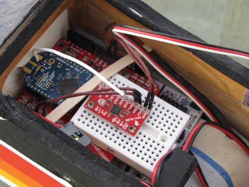

What follows is a description of this project.  The first thing that I will do is describe the various components that I selected for this project.  This will be a very general overview of the various hardware and software components.  This will then be followed by the real work in this project and that was the software development.

Component Overview:
-------------------

ST Microelectronics Nucleo STM32F401RE Development Board
--------------------------------------------------------

The first step in this project was the selection of a development board.  For the first  version of my IMU, I selected the Propeller Mulit-Core processor produced my Parallax.  This processor worked fine, but I found that development took a long time due to the limitations of the processor.  So this time, I wanted to use an ARM based processor, in part, because I feel that this processor will have a very strong future, and because I've been impressed by the power of this processor.

Going through the selection of ARM based development boards, I narrowed my choice down to the ST Microelectronics Nucleo Development Board.  The reasons that I chose this board are many.  The first reason is because the version of the Nucleo that I have has an STM32F401RE Cortex M4 processor running at 84MHz.  The next reason is because the board supports the Arduino daughter board (shield) footprint.  This makes the issue of setting up adapter boards very simple.  And seeing that I already have the required Arduino shields from the first version of my IMU, the choice of this board was even simpler.  And the last reason that I chose this board is because I received one for free at the last EELive in San Jose. Here is what the base development board looks like:

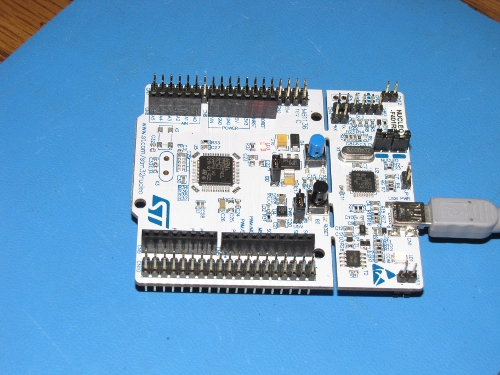

For more information on the STM32F401RE Nucleo board, please click
[here](http://www.st.com/nucleoF401RE-pr).

Micrium uC/OS-III Real Time Operating System
--------------------------------------------

The first thing that you may ask is "Why a Real Time Operating System?"  The answer is simple.  I like to challenge myself.  I've been reading about RTOSs and wanted to get some practical experience, so this was a great opportunity.  The next question you may ask is "Why Micrium uC?" Again the answer is simple in the Micrium has generated many books on their RTOS.  The books are free to download from the Micrium [website](http://micrium.com) in pdf, or as I did, purchased through Amazon (I prefer the feel of a real book over that of viewing a document on a computer).  They produce many different versions of their books highlighting different Microprocessor families.  One of the books is for the STM32 ARM processors, which is the processor family that I had chosen for this project.  But if you do chose to download the pdf, you will have to register with their website.

I feel that choosing to use a RTOS simplified the software design for I don't have to worry about the scheduling of interrupts to service the different required modules.  The scheduling will all be handled by the OS, all I have to do is set the proper priorities for the different functions.  I will go through this in more detail during the explanation of the software.  I will also go over the porting of the OS over to the STM32F401RE and the development of the Board Support Package (BSP) for the STM32 Nucleo development board.

Digi xBee 802.15.4 Wireless Transceivers
----------------------------------------

I wanted to add wireless communications with the IMU and decided to use the Digi xBee modules. I chose to use the xBee Pro 900 with wire antenna for the IMU (Sparkfun [WRL-09097](http://www.sparkfun.com/products/9097)) and the xBee Pro 900 with the RPSMA antenna for the base station (Sparkfun [WRL-09099](http://www.sparkfun.com/products/9099)).  I chose to use the 900MHz modules to avoid any possible conflict with 2.4GHz RC transmitters and receivers.  For mounting the module in the IMU, I chose to use the Sparkfun xBee Shield ([WRL-12847](http://www.sparkfun.com/products/12847)).  For the base station, I chose the Sparkfun xBee Explorer USB ([WRL-11812](http://www.sparkfun.com/products/11812)).  This module contains an FTDI chip so talking to the module is as simple as plugging in a USB cable.  I'll go over the software for both sides later.  Here is what the individual modules look like.

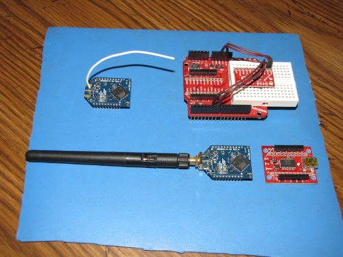

And this is what they look like with the transceivers mounted to the appropriate adapter boards.

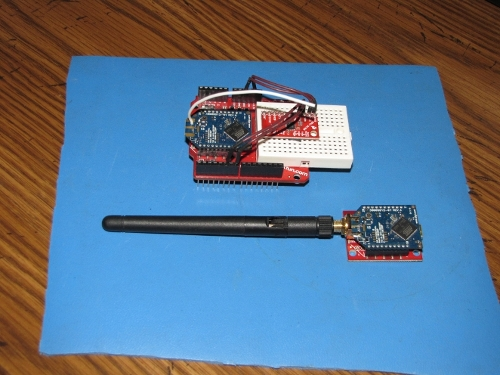

The last point in detail with the Digi xBee modules that I'd like to cover is communications.  You talk to these devices through UART (or USART in the case of the ARM processor that I'm using).  So sending and receiving data is as simple as setting up the UART controller and coding the send and receive modules for the IMU side of things.  For the base station, it's a simple matter of installing the FTDI virtual com port driver and then writing the send and receive modules as if it's a standard com port.  Easy stuff on both sides.  I'll cover the software in more detail later.

STM32 Nucleo Development Board Modifications
--------------------------------------------

We will need to make some minor modifications to the Nucleo board to be able to connect the correct USART IO pins to the xBee module mounted on the Sparkfun xBee Shield.  The designers of the STM32 Nucleo made the board highly configurable through the use of solder bridge jumpers.  This allows the end user to change the default configuration of the board by removing and/or installing solder bridges so that the board will match his/her requirements.  This is what we will need to do to get the board configured properly to match the xBee shield.  So get your protective eye-ware ready and heat up those soldering irons!

We will be utilizing USART2 for our communications between the '401RE and the xBee module.  By default the USART2 communication between the '401RE and ST-LINK MCU is enabled in order to support Virtual Com Port for mbed (SB13 and SB14 ON, SB62 and SB63 OFF). We will need to remove this feature and modify it to reroute the signals to the Arduino connector (SB13 and SB14 OFF, SB62 and SB63 ON) (PA3 to D0 and PA2 to D1).

1.  Remove the 0 ohm resisters SB13 and SB14.  These are 0402 chip resistors which are not that easy to work with when soldering or desoldering.  I've found that the easiest way to desolder chip resistor or chip caps is with two soldering irons, both with fine tip points, one on each side of the chip resistor.  Simply heat both side of the chip resistor and then lift it off of the board.
2.  Install solder bridges at locations SB62 and SB63.  If your good with a soldering iron, you could simply reuse the 0 ohm resistors that you removed from SB13 and sB14.  But if you're clumsy like me and end up loosing the 0402 resistors, then just create a solder bridge to connect the two points for SB62 and SB63 (as the name solder bridge implies).  

That's it for the modifications.  Now everything should be correct when we get to testing the communications between the '401RE and the xBee module.

InvenSense MPU-9150 9DOF Motion Processor
-----------------------------------------

I'm starting to get quite a collection of one axis, two axis, and three axis accelerometers, gyros, and magnetometers.  Some have a single function while others have two and now all three functions.  Within my selection, I chose to use the InvenSense [MPU-9150](http://www.invensense.com/mems/gyro/mpu9150.html).  The reason why I chose to use this one is that this was my latest acquisition in MEMS sensors.  This package contains a three axis accelerometer, a three axis gyro, and a three axis magnetometer.  This type of configuration is usually referred to as nine degrees of freedom, or 9DOF for short.

I purchased a breakout board from Sparkfun that has the MPU-9150 mounted on it ([SEN-11486](https://www.sparkfun.com/products/11486)).  You can see it in the picture above plugged into the solderless breadboard.  I then used short jumper wires to connect it to the appropriate signals on the xBee Shield. I'm still not sold on this sensor, hence the reason for the solderless breadboard.

Miscellaneous Items
-------------------

The last challenge that I had to solve was you to power the IMU.  On the bench, this was simple; the unit is powered through the USB port.  The USB port is also used to download new versions of the firmware, so development is easy.  The challenge comes in play when wanting to power the IMU in the aircraft.  The obvious chose was to power the IMU from the same battery that's powering the receiver in the aircraft.  To do this, I made two different cables. The first cable was to power the IMU directly from a 4.8V nicad battery pack.   What I did was to simply modify a servo extension cable by removing the signal cable and filing down the female end to have only two connector positions.  This is the one you see in the following photo.  One end of the cable is connected to the battery pack and the other is connected directly to the Nucleo board.

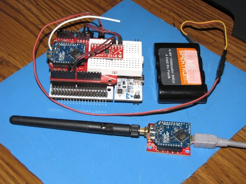

The cable to be used in the aircraft was a little more challenging.  I decided to power the IMU directly off of the receiver from an open channel.  This is were a servo would normally connect.  So for this type of connection, I needed to have a female connector on both ends of the cable.  This type of cable is not normally available.  So to archive this, what I did was to cut the wire and connector off of a couple of dead 4.8V battery packs and then splice them together. This worked great.  And by doing this, my IMU is turned on and off by the same power switch as the aircraft, so I don't have to worry about having some means of powering it up and down separately from the aircraft.  Simple always wins out with me.

Here is a repeat of the first photo on this page.  In it, you can see the IMU mounted in my aircraft with the wing removed.  The cable that I just spoke about is visible on the right side of the IMU connected directly to the Nucleo board and then disappearing in the foam that I have wrapped around my receiver.


So that's it for the overview of the hardware and the reasons why I chose what I did.  I hope you enjoyed my writeup so far and if you did, it's now time to get to the real work, the development of the firmware and software.

Firmware and Software Overview:
-------------------------------

What I will cover here is the porting of Micrium uC/OS-III to the STM32F401RE processor, the development of the Board Support Package (BSP) for the STM32 Nucleo, and the writing of the individual RTOS tasks.  I will then cover the GUI that I developed that will run on the base station.

IAR Embedded Workbench for ARM
------------------------------

The first decision that I had to make for the software was what IDE and
tool chain to use.  Of the different IDEs that Micrium recommends, I
chose to use the KickStart edition of [IAR Embedded
Workbench](http://www.iar.com/Products/IAR-Embedded-Workbench/ARM/). 
The KickStart edition is free to use for non-commercial products and
supports the STM32F401RE.  So that's great.  The only drawback is that
the code is limited to 32K bytes.  But the Micrium uC/OS-III kernel
along with my BSP and runtime code fits within this limit, so everything
is good so far.  Only time will tell if I hit the 32K limit.

STM does a good explanation of the installation of the IAR Embedded
Workbench and related software in their [Getting started with the STM32
Nucleo](http://www.st.com/stonline/stappl/resourceSelector/app?page=fullResourceSelector&doctype=user_manual&LineID=1847)
document.  So my recommendation is to read through this document first
and get the proper software installed first.  The next step is then to
verify that everything is working correctly prior to attempting the
porting of the RTOS.

Porting Micrium uC/OS-III RTOS to STM32 Nucleo
----------------------------------------------

The first task at hand is to port the Micrium uC/OS-III RTOS to the
STM32F401RE processor.  Next is the development of a basic board support
package that we can use to verify the OS.   Of the various packages that
Micrium provides, I found one that support the STM32F429.  The STM32F429
is very similar to the STM32F401RE in that they are both Cortex M4
processors. One of the main differences between the two processors is
that the 'F429 is clocked at twice the frequency of the 'F401.  

So what you'll need to do next is to download and install the Micrium
uC/OS-III kernel package for the STM32F429.  Micrium now has it listed
as
[Micrium_STM32F429II-SK_OS3](http://micrium.com/download/micrium-stm32f429ii-sk-ucos-iii/). 
The package has since been updated from the original package that I
downloaded and used, so I'll need to verify that there are no additional
changes from what I've made so far in my port to the STM32F401RE. 
You'll need to unzip the file at the root directory.  


Next item is to open IAR Embedded Workbench.  When it comes up, open up
the following workspace by selecting it from File->Open->Workspace...

C:MicriumSoftwareEvalBoardsSTSTM32F429IIK-SKuCOS-IIIIARuCOS-III.eww

This should load the proper environment and files into the IDE and look
something like this:

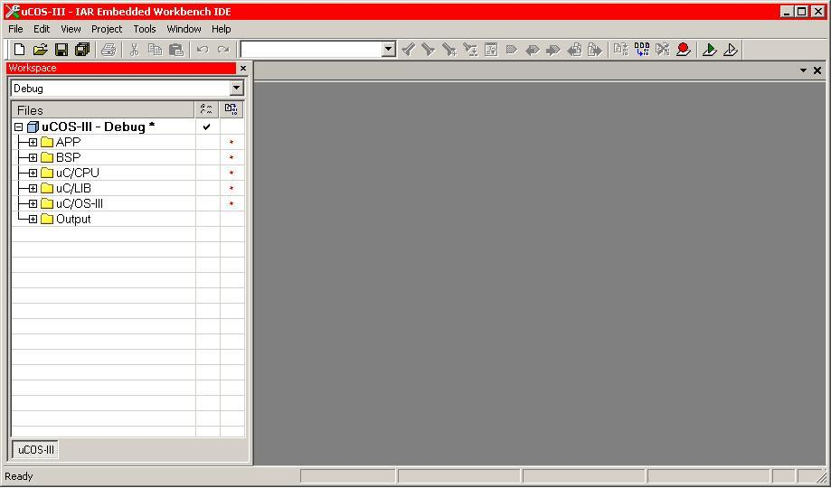

The next thing is to modify the environment to match the processor and
development board that we're using.  So open up the options dialog box
by selecting Projects->Options...  When the options dialog box opens,
in the General Options Category, select the Target tab.  Then for the
device field, select ST->STM32F401->ST STM32F401xE as the target
device by clicking on the button to the right of the Device text field. 
The Options diaglog box should look like this when you're done:

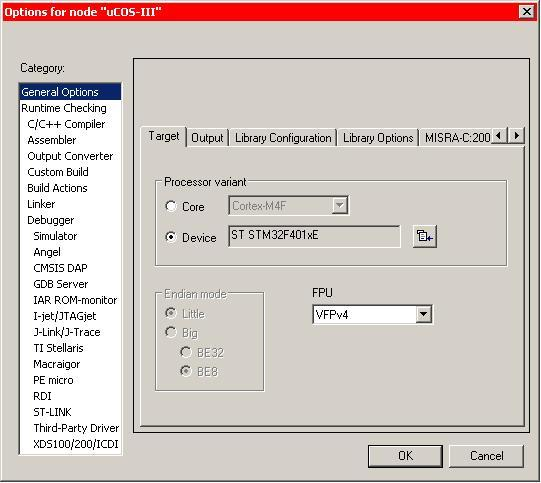

With the Options dialog still open, now select Category Runtime Checking
-> Debugger.  In the Setup tab, set the Driver to ST-LINK like this:

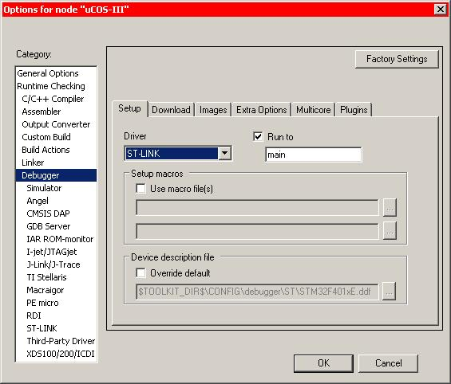

And in the Download tab, set Use flash loader(s) like this:

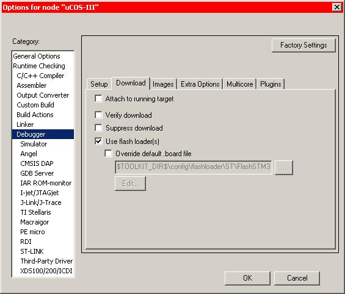

Now select Category Runtime Checking -> Debugger -> ST_LINK and set
the Reset option to 'Connect during Reset', and Change the Interface to
SWD by selecting its radial button.  Then Change the Clock setup for CPU
clock to 84MHz and leave SWO clock set to 2000KHz.  Once everything
looks like the following screen capture, click the OK button to save the
changes.  

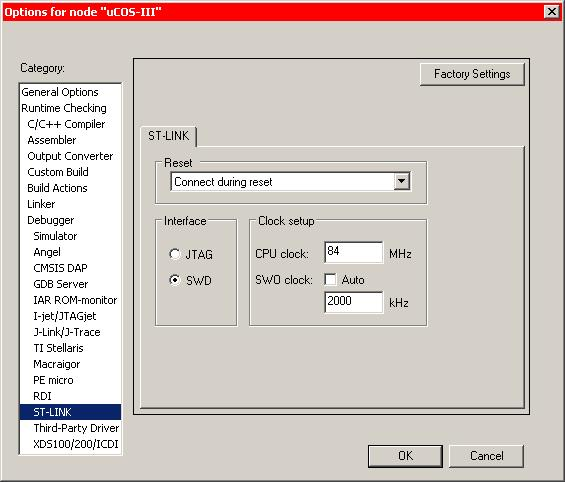

Just for fun, with the IAR IDE selected you can press the F7 function
key to do a Make and verify that everything builds without any warnings
or errors.

Now the fun part begins!  From here on in, it's all about the code.

We will be making the basic changes to the board support package (BSP)
to change it from supporting the IAR Kickstart kit for the STM32F429II
to supporting the STM32 Nucleo and its STM32F401RE.  The intent of the
changes are so that we can load and test the basic functionality of the
RTOS.  To start with, we will be modifying the BSP's LED support so that
we can use the LED to verify that the RTOS is running.  

The IAR Kickstart has four LEDs while the Nucleo only has one.  So what
we will be doing is modifying the support for LED1 to match the Nucleo's
LED and deleting the support for LED2 through LED4.  So we will start by
editing the following board support file:

C:MicriumSoftwareEvalBoardsSTSTM32F429II-SKBSPbsp.c

You can use the workspace listing in the IDE to select
uCOS-III->BSP->bsp.c.  Once you have the file open, the easiest way to
find the LED support is to use the IDE's search feature.  So go to Edit
-> Search and Replace -> Find In Files... and type in LED1.  This will
bring up a list of all occurrences of LED1 in all the files used to
build the project.  You will find that all occurrences are in file,
bsp.c, so this makes things easy.  The first will be to change the
#defines for the LEDs.  So we will be editing the following code to
remove the unused LEDs and to set LED1 to match the IO pin on the
Nucleo.  The required changes are to modify the following code:

```
/*
 ************************************************************************
 *                          LOCAL DEFINES
 ************************************************************************
 */
 
#define  BSP_GPIOA_LED1                DEF_BIT_04
#define  BSP_GPIOG_LED2                DEF_BIT_03
#define  BSP_GPIOE_LED3                DEF_BIT_02
#define  BSP_GPIOE_LED4                DEF_BIT_03
````

To look like this:

```
/*
 ************************************************************************
 *                           LOCAL DEFINES
 ************************************************************************
 */
 
 #define  BSP_GPIOA_LED1               DEF_BIT_05
```

And now it's on to the LED initialization routine, which when completed,
should look like this:
```
/*
 ************************************************************************
 *
 *                        BSP_LED_Init()
 *
 * Description : Initialize any or all the LEDs on the board.
 *
 * Argument(s) : none.
 *
 * Return(s)   : none.
 *
 * Caller(s)   : Application.
 *
 * Note(s)     : The LED pins are active-low on the STM32F429II-SK board
 ************************************************************************
 */
 
 void  BSP_LED_Init()
 {
     GPIO_InitTypeDef  gpio_init;
     /* Configure GPIOA for LED1 */
     BSP_PeriphEn(BSP_PERIPH_ID_GPIOA);
     gpio_init.GPIO_Pin   = BSP_GPIOA_LED1;
     gpio_init.GPIO_Mode  = GPIO_Mode_OUT;
     gpio_init.GPIO_OType = GPIO_OType_PP;
     gpio_init.GPIO_PuPd  = GPIO_PuPd_UP;
     gpio_init.GPIO_Speed = GPIO_Speed_50MHz;
     GPIO_Init(GPIOA, &gpio_init);
 }
```

The LED On function is next:

```
/*
 ************************************************************************
 *                        BSP_LED_On()
 *
 * Description : Turn ON any or all the LEDs on the board.
 *
 * Argument(s) : led     The ID of the LED to control:
 *
 *                       0    turns ON ALL  LEDs
 *                       1    turns ON user LED1
 *
 * Return(s)   : none.
 *
 * Caller(s)   : Application.
 *
 * Note(s)     : none.
 ************************************************************************
 */
 
 void  BSP_LED_On (CPU_INT08U led)
 {
     switch (led) {
         case 0u:
              GPIO_SetBits(GPIOA, BSP_GPIOA_LED1);
              break;
         case 1u:
              GPIO_SetBits(GPIOA, BSP_GPIOA_LED1);
              break;
         default:
              break;
     }
 }
```
The LED Off function:
```
/*
 ************************************************************************
 *                        BSP_LED_Off()
 *
 * Description : Turn OFF any or all the LEDs on the board.
 *
 * Argument(s) : led     The ID of the LED to control:
 *
 *                       0    turns OFF ALL the LEDs
 *                       1    turns OFF user LED1
 *
 * Return(s)   : none.
 *
 * Caller(s)   : Application.
 *
 * Note(s)     : none.
 ************************************************************************
 */
 
 void  BSP_LED_Off (CPU_INT08U  led)
 {
     switch (led) {
         case 0u:
              GPIO_ResetBits(GPIOA, BSP_GPIOA_LED1);
              break;
         case 1u:
              GPIO_ResetBits(GPIOA, BSP_GPIOA_LED1);
              break;
         default:
              break;
     }
 }
```
And last is the LED toggle function:
```
/*
 ************************************************************************
 *                           BSP_LED_Toggle()
 *
 * Description : TOGGLE any or all the LEDs on the board.
 *
 * Argument(s) : led     The ID of the LED to control:
 *
 *                       0    TOGGLE ALL the LE
 *                       1    TOGGLE user LED1
 *
 * Return(s)   : none.
 *
 * Caller(s)   : Application.
 *
 * Note(s)     : none.
 ************************************************************************
 */
 
 void  BSP_LED_Toggle (CPU_INT08U  led)
 {
     CPU_INT32U  pins;
 
     switch (led) {
         case 0u:
              /* Read data (current state of output pins) in GPIOA   */
              pins  =  GPIO_ReadOutputData(GPIOA);
              /* Tells which pins (other than pin for LED1) are ON   */
              pins ^=  BSP_GPIOA_LED1;
              /* If there are any,turn them OFF and leave LED1 ON    */
              GPIO_SetBits(  GPIOA,   pins  &  BSP_GPIOA_LED1);
              GPIO_ResetBits(GPIOA, (~pins) &  BSP_GPIOA_LED1);
              break;
         case 1u:
              pins  = GPIO_ReadOutputData(GPIOA);
              pins ^= BSP_GPIOA_LED1;
              GPIO_SetBits(  GPIOA,   pins   &  BSP_GPIOA_LED1);
              GPIO_ResetBits(GPIOA, (~pins)  &  BSP_GPIOA_LED1);
              break;
         default:
              break;
     }
 } 
```
After the changes are made, you can press the F7 function key to verify
that everything compiles and links without errors or warnings.

The next area that needs to be addressed is the programming of the '401s
clocking.  We will need to rewrite the clocking code from using the
external input to using the internal oscillator.  This was required on
the version of the Nucleo that I have for it has no external oscillator
nor does it use the clock coming from the ST-LINK MPU (see the Nucleo
User Manual,
[UM1724](http://www.st.com/stonline/stappl/resourceSelector/app?page=fullResourceSelector&doctype=user_manual&LineID=1847),
for more detail on the clocking).  This little fact threw me for a while
for the schematic shows the board using the external clock coming from
the ST-LINK MPU.  I've always been one who goes by the schematic first
for in my experience, the documentation generally lags behind.  It was
only after I read a one line note on the bottom of page 22 that clued me
in on what modifications were needed in the code.  That is, my board
version is C-01 and the schematic is for board version C-02 and above. 
It's always the little details that will catch you.  But please note
that the code that I wrote should work on any version of the Nucleo. 
It's just that the clocking will not be as accurate with the internal
oscillator as it would be with an external oscillator.  But for what I'm
using the '401 for, the internal oscillator will be accurate enough.

The initialization for the clocking is done in function BSP_Init(), so
this is the next function that will need to be updated.  The required
changes for the clocking was to change it from using the external input,
HSE, to using the internal oscillator, HSI.  So the changes were to the
source selection along with the calculations to maintain the same
internal clocking frequencies for AHB, APB2, APB1, and for PLL.  

We need to start with adding a couple of #define statements to the
Register Bits and modifying the bits for setting up the PLL.  When
you're done, the changes should look like this:
```
/*

 ************************************************************************
 *                           REGISTER BITS
 ************************************************************************
 */

 ...
 #define  HSI_TIMEOUT_VAL                              0x0500u    // add
 ...
 #define  BSP_BIT_RCC_CR_HSIRDY                    DEF_BIT_01     // add
 ...
 #define  BSP_BIT_RCC_PLLCFGR_PLLM                         16u    // modify
 #define  BSP_BIT_RCC_PLLCFGR_PLLN                        336u
 #define  BSP_BIT_RCC_PLLCFGR_PLLP                          4u    // modify
 #define  BSP_BIT_RCC_PLLCFGR_PLLQ                          7u
```
And the changes to BSP_Init() should look like this:
```
/*
 ************************************************************************
 *                           BSP_Init()
 *
 * Description : Initialize the Board Support Package (BSP).
 *
 * Argument(s) : none.
 *
 * Return(s)   : none.
 *
 * Caller(s)   : Application.
 *
 * Note(s)     : (1) This function SHOULD be called before any other BSP
 *                   function is called.
 *
 *               (2) CPU instruction / data tracing requires the use of
 *                   the following pins :
 *                   (a) (1) Asynchronous      :  PB[3]
 *                       (2) Synchronous 1-bit :  PE[3:2]
 *                       (3) Synchronous 2-bit :  PE[4:2]
 *                       (4) Synchronous 4-bit :  PE[6:2]
 *
 *                   (c) The application may wish to adjust the trace
 *                       bus width depending on I/O requirements.
 ************************************************************************
 */
  
 void  BSP_Init (void)
 {
     CPU_INT32U reg_val;
     CPU_INT32U hsi_rdyctr;
  
     BSP_IntInit();
  
     /* ---------- RESET CLOCK CONFIG. REGISTERS ----------- */
     /* Set HSION bit                                        */
     DEF_BIT_SET(BSP_REG32_RCC_CR,BSP_BIT_RCC_CR_HSION);
     /* Reset CFGR register                                  */
     BSP_REG32_RCC_CFGR  = (CPU_INT32U)0u;
     /* Reset HSEON, CSSON and PLLON bits                    */
     BSP_REG32_RCC_CR    &= 0xFEF6FFFFu;
     /* Reset PLLCFGR register                               */
     BSP_REG32_RCC_PLLCFGR = BSP_MSK_RCC_PLLCFGR_RST;
     /* Reset HSEBYP bit                                     */
     DEF_BIT_CLR(BSP_REG32_RCC_CR, BSP_BIT_RCC_CR_HSEBYP);
  
     /* ----------- HSI OSCILLATOR CONFIGURATION ----------- */
     /* HSI = 16MHz Int. crystal.                            */
     DEF_BIT_CLR(BSP_REG32_RCC_CR,BSP_MSK_HSECFG);
  
     DEF_BIT_SET(BSP_REG32_RCC_CR,BSP_BIT_RCC_CR_HSION);
     /* Wait for HSI to Start Up                             */
     do {
         hsi_rdyctr++;
     } while ((hsi_rdyctr < HSI_TIMEOUT_VAL)  &&
               DEF_BIT_IS_CLR(BSP_REG32_RCC_CR, BSP_BIT_RCC_CR_HSIRDY));
  
     if (hsi_rdyctr == HSI_TIMEOUT_VAL) {
         return;
     }
  
     /* --------------- SET UP THE AHB PRESCALER ----------- */
     /* HCLK = AHBCLK  = PLL / AHBPRES(1) = 84MHz.           */
     reg_val = (CPU_INT32U)0u;
     reg_val = BSP_REG32_RCC_CFGR;
     /* Clear HPRE[3:0] bits                                 */
     DEF_BIT_CLR(reg_val, BSP_MSK_RCC_CFGR_HPRE);
     /* Set HPRE[3:0] bits according to RCC_SYSCLK value     */
     DEF_BIT_SET(reg_val, BSP_MSK_RCC_CFGR_SYSCLKDIV1);
     /* Store the new value in RCC_CFGR register             */
     BSP_REG32_RCC_CFGR = reg_val;
  
     /* ---------------- CONFIGURE APB2 CLOCK -------------- */
     /*   APB2CLK = AHBCLK  / APB2DIV(1) = 84MHz.            */
     reg_val = BSP_REG32_RCC_CFGR;
     /* Clear PPRE2[2:0] bits                                */
     DEF_BIT_CLR(reg_val, BSP_MSK_RCC_CFGR_PPRE2);
 
     /* Set PPRE2[2:0] bits according to RCC_HCLK value      */
     DEF_BIT_SET(reg_val, BSP_MSK_RCC_CFGR_HCLK_DIV1 << 3u);
     /* Store the new value                                  */
     BSP_REG32_RCC_CFGR = reg_val;
  
     /* ---------------- CONFIGURE APB1 CLOCK -------------- */
     /* APB1CLK = AHBCLK  / APB1DIV(2) = 42MHz (max).        */
     reg_val = BSP_REG32_RCC_CFGR;
     /* Clear PPRE1[2:0] bits                                */
     DEF_BIT_CLR(reg_val,BSP_MSK_RCC_CFGR_PPRE1);        
     /* Set PPRE1[2:0] bits according to RCC_HCLK value      */
     DEF_BIT_SET(reg_val, BSP_MSK_RCC_CFGR_HCLK_DIV2);   
     /* Store the new value in RCC_CFGR register             */
     BSP_REG32_RCC_CFGR    =     reg_val;
  
     /* ------------- CONFIGURE AND ENABLE PLL ------------- */
     /* PLL_M = 16, PLL_N = 336, PLL_P = 4, PLL_Q = 7        */
     /* PLLCLK    = HSE * (PLLN / PLLM)      = 336MHz.       */
     /* SYSCLK    = PLLCLK / PLLP            =  84MHz.       */
     /* OTG_FSCLK = PLLCLK / PLLQ            =  48MHz.       */
  
     BSP_REG32_RCC_PLLCFGR =   ( BSP_BIT_RCC_PLLCFGR_PLLM )
                             | ( BSP_BIT_RCC_PLLCFGR_PLLN << 6u )
                             | ((BSP_BIT_RCC_PLLCFGR_PLLP >> 1u ) -1u ) << 16u
                             | ( BSP_BIT_RCC_PLLCFGR_PLLQ << 24u)
                             & (~BSP_MSK_PLLCFGR_PLLSRC_HSE     );
 
     /* set HSI for input clock to pll */
     DEF_BIT_SET( BSP_REG32_RCC_CR, BSP_BIT_RCC_CR_PLLON);
     /* Wait for PLL to lock.                                */
     while ( DEF_BIT_IS_CLR( BSP_REG32_RCC_CR,
                             BSP_BIT_RCC_CR_PLLRDY)) {
         ;
     }
  
     /* ------------- CONFIGURE FLASH MEMORY --------------- */
 
     /* Allow 2 Flash Wait States when HCLK <= 84MHz.        */
     DEF_BIT_SET(BSP_REG32_FLASH_ACR, BSP_MSK_FLASHLATENCY_3WS);
  
     /* Enable Prefetch, Instruction Cache, and Data Cache.  */
     DEF_BIT_SET(BSP_REG32_FLASH_ACR, (BSP_BIT_FLASH_ACR_PRFTEN  |
                                       BSP_BIT_FLASH_ACR_ICEN    |
                                       BSP_BIT_FLASH_ACR_DCEN));
  
     /* -------- SELECT PLL OUTPUT AS SYSTEM CLOCK --------- */
     /* HCLK = SYSCLK = PLL = 168MHz.                        */
     DEF_BIT_SET(BSP_REG32_RCC_CFGR, BSP_MSK_SYSCLK_SRC_PLLCLK);
  
     /* Wait until PLL is selected as system clock source    */
     while((BSP_REG32_RCC_CFGR & BSP_MSK_RCC_CFGR_SWS)
                               != BSP_MSK_RCC_CFGR_SWS_PLL){
         ;
     }
 
     /* Initialize user LEDs                                 */
     BSP_LED_Init();
     /* Initialize UART2                                     */
     //BSP_USART_Init();
     /* Initialize I2C3                                      */
     //BSP_I2C3_Init();
  
 #ifdef TRACE_EN
     /* See project / compiler preprocessor options.         */
     /* Enable tracing (see Note #2).                        */
     BSP_CPU_REG_DBGMCU_CR |=  BSP_DBGMCU_CR_TRACE_IOEN_MASK;
     /* Clr trace mode sel bits.                             */
     BSP_CPU_REG_DBGMCU_CR &= ~BSP_DBGMCU_CR_TRACE_MODE_MASK;
     /* Cfg trace mode to synch 4-bit.                       */
     BSP_CPU_REG_DBGMCU_CR |= BSP_DBGMCU_CR_TRACE_MODE_SYNC_04;
 #endif
 }
```
The last change that we need to make is to update AppTaskStart() to
support only LED1.  AppTaskStart() is the only task defined in the
program with the exception of the idle task.  We will be using
AppTaskStart() to verify that the RTOS is running.  What it does is
toggle the LED every 100mS.  So if we load and run the RTOS and the LED
is toggling, then the RTOS is running properly.  You will find
AppTaskStart() in app.c in the following location:

C:MicriumSoftwareEvalBoardsSTSTM32F429II-SKuCOS-IIIapp.c

You can use the workspace listing in the IDE to select
uCOS-III->APP->app.c.  The change is simply to delete the lines of
code that support LED2 through LED4 as detailed in the code segment
below:
```
static  void  AppTaskStart (void *p_arg)
 {
     ...
     /* Task body, always written as an infinite loop.       */
     while (DEF_TRUE) { 
 
         BSP_LED_Toggle(1u);
         OSTimeDlyHMSM(0u, 0u, 0u, 100u,
                       OS_OPT_TIME_HMSM_STRICT,
                       &err);
 // Delete from here:
         BSP_LED_Toggle(2u);
         OSTimeDlyHMSM(0u, 0u, 0u, 100u,
                       OS_OPT_TIME_HMSM_STRICT,
                       &err);
 
         BSP_LED_Toggle(3u);
         OSTimeDlyHMSM(0u, 0u, 0u, 100u,
                       OS_OPT_TIME_HMSM_STRICT,
                       &err);
 
         BSP_LED_Toggle(4u);
         OSTimeDlyHMSM(0u, 0u, 0u, 100u,
                       OS_OPT_TIME_HMSM_STRICT,
                       &err);
 // to here...
     }
 ...
 }
```
At this point, we can build the program to make sure that everything is
correct.  So simply press the F7 function key to compile and link the
program.  If there are any issues, you'll need to correct them.  Once
everything compiles and links, we can actually test our changes on the
Nucleo board.  

Assuming that you've gone though the set-up as defined by STMicro for
the Nucleo board, you should only need to connect the board to an open
USB port.  Once the board is connected, do a Download and Debug from the
IDE.  You can do this from the Project menu or by pressing the Download
and Debug button.  If everything goes as expected, the IDE should place
you at the main() function waiting for you to do something.  Either
select Go from the Debug menu or press the F5 function key.  This should
start the Micrium RTOS with the single task to toggle the LED.  Simply
verify that it is working by noting that the green user LED is flashing
on the Nucleo development board.  

It's as simple as that; we now have an operational RTOS running on the
STMicro Nucleo development board.  If you want to do any additional
verification for the RTOS, Micrium defines a very thorough procedure in
their documentation (Chapter 18-5, TESTING A PORT).  Initially, I went
though the procedure to verify my port.  It also gives you a little more
understanding of the Micrium RTOS and use of the debugging features of
the IAR IDE.

What we will be doing next is extending the board support package by
adding support for USART and I2C so that we can communicate with the
xBee Transceiver and the InvenSense MEMS sensor.

Adding USART and I2C Support to BSP
-----------------------------------

The first task at hand is to develop the drivers for the USART and I2C
peripherals.  So let's start with the driver for the USART.  We begin by
adding the prototypes for the USART to file bsp.h as such:
```
/*
 ************************************************************************
 *                           USART SERVICES
 ************************************************************************
 */
 
 void BSP_USART_Init(void);
 void BSP_USART_Write(CPU_INT08U wrt_byte);
 void BSP_USART_Write_Str(CPU_INT08U *wrt_str);
```
And next, we can add the actual code to bsp.c:
```
/*
 ************************************************************************
 *                           BSP_USART_Init()
 *
 * Description : Initialize UART2.
 *
 * Argument(s) : none.
 *
 * Return(s)   : none.
 *
 * Caller(s)   : Application.
 *
 * Note(s)     : Initializes USART2 to
 *               230400 baud, 8 bits, no parity, 1 stop bit
 ************************************************************************
 */

 void BSP_USART_Init(void)
 {
     // code example copied from:
     //      "/dev/thrash Elia's tinkerings @ www.eliaselectronics.com"
     GPIO_InitTypeDef GPIO_InitStructure;
     USART_InitTypeDef USART_InitStructure;
     NVIC_InitTypeDef NVIC_InitStructure;
 
     /* enable peripheral clock for USART2 */
     RCC_APB1PeriphClockCmd(RCC_APB1Periph_USART2, ENABLE);
 
     /* GPIOA clock enable */
     RCC_AHB1PeriphClockCmd(RCC_AHB1Periph_GPIOA, ENABLE);
 
     /* GPIOA Configuration:  USART2 TX on PA2 */
     GPIO_InitStructure.GPIO_Pin = GPIO_Pin_2;
     GPIO_InitStructure.GPIO_Mode = GPIO_Mode_AF;
     GPIO_InitStructure.GPIO_Speed = GPIO_Speed_50MHz;
     GPIO_InitStructure.GPIO_OType = GPIO_OType_PP;
     GPIO_InitStructure.GPIO_PuPd = GPIO_PuPd_UP;
     GPIO_Init(GPIOA, &GPIO_InitStructure);
 
     /* GPIOA Configuration:  USART2 RX on PA3 */
     GPIO_InitStructure.GPIO_Pin = GPIO_Pin_3;
     GPIO_InitStructure.GPIO_Mode = GPIO_Mode_AF;
     GPIO_Init(GPIOA, &GPIO_InitStructure);
 
     /* Connect USART2 pins to AF2 */
     // TX = PA2
     GPIO_PinAFConfig(GPIOA, GPIO_PinSource2, GPIO_AF_USART2);
     // RX = PA3
     GPIO_PinAFConfig(GPIOA, GPIO_PinSource3, GPIO_AF_USART2);
 
     USART_InitStructure.USART_BaudRate = 230400;
     USART_InitStructure.USART_WordLength = USART_WordLength_8b;
     USART_InitStructure.USART_StopBits = USART_StopBits_1;
     USART_InitStructure.USART_Parity = USART_Parity_No;
     USART_InitStructure.USART_HardwareFlowControl =
                                     USART_HardwareFlowControl_None;
     USART_InitStructure.USART_Mode = USART_Mode_Tx | USART_Mode_Rx;
     USART_Init(USART2, &USART_InitStructure);
 
     USART_ITConfig(USART2, USART_IT_RXNE, ENABLE);
     NVIC_InitStructure.NVIC_IRQChannel = USART2_IRQn;
     NVIC_InitStructure.NVIC_IRQChannelPreemptionPriority = 0;
     NVIC_InitStructure.NVIC_IRQChannelSubPriority = 0;
     NVIC_InitStructure.NVIC_IRQChannel = ENABLE;
     NVIC_Init(&NVIC_InitStructure);
 
     USART_Cmd(USART2, ENABLE); // enable USART2
 }
 
 /*
 ************************************************************************
 *                           BSP_USART_Write()
 *
 * Description : Writes a byte to UART2.
 *
 * Argument(s) : wrt_byte   The character to be writen to the USART port.
 *
 * Return(s)   : none.
 *
 * Caller(s)   : Application.
 *
 * Note(s)     : none.
 ************************************************************************
 */

 void BSP_USART_Write(CPU_INT08U wrt_byte)
 {
     while (USART_GetFlagStatus(USART2, USART_FLAG_TXE) == 0)
     {
         ;
     }
     USART_SendData(USART2, wrt_byte); // defined in stm32f4xx_usart.h
 }
 
 /*
 ************************************************************************
 *                           BSP_USART_Write_Str()
 *
 * Description : Writes a string of bytes to USART2.
 *
 * Argument(s) : wrt_byte   The character to be writen to the USART port.
 *
 * Return(s)   : none.
 *
 * Caller(s)   : Application.
 *
 * Note(s)     : none.

 ************************************************************************
 */
 void BSP_USART_Write_Str(CPU_INT08U *wrt_str)
 {
     CPU_INT32S i;
 
     i = 0;
     while (wrt_str[i] != '0')
         BSP_USART_Write(wrt_str[i++]);
 }
```
Wow.  That seemed quite painless.  So let's move on to the I2C driver. 
So now let's add the I2C prototypes to bsp.h:
```
/*
 ************************************************************************
 *                           I2C SERVICES
 ************************************************************************
 */
 
 void BSP_I2C3_Init(void);
 void BSP_I2C_Start(I2C_TypeDef* I2Cx, CPU_INT08U address, CPU_INT08U direction);
 void BSP_I2C_Write(I2C_TypeDef* I2Cx, CPU_INT08U data);
 CPU_INT08U BSP_I2C_Read_ACK(I2C_TypeDef* I2Cx);
 CPU_INT08U BSP_I2C_Read_NACK(I2C_TypeDef* I2Cx);
 void BSP_I2C_Stop(I2C_TypeDef* I2Cx);
```
And now for the additional code to be added to bsp.c to support I2C:
```
/*
 ************************************************************************
 *                           BSP_I2C3_Init()
 *
 * Description : Initialize i2c3.
 *
 * Argument(s) : none.
 *
 * Return(s)   : none.
 *
 * Caller(s)   : Application.
 *
 * Note(s)     : Initializes I2C3 to 100K BPS and 7 bit address.
 *               Connect the I2C3 functions to the following pins:
 *               1. SCL on PA8 (Arduino D7)
 *               2. SDA on PB4 (Arduino D5)
 ************************************************************************
 */

 void BSP_I2C3_Init(void)
 {
     GPIO_InitTypeDef GPIO_InitStruct;
     I2C_InitTypeDef I2C_InitStruct;
 
     // enable APB1 peripheral clock for I2C3
     RCC_APB1PeriphClockCmd(RCC_APB1Periph_I2C3, ENABLE);
 
     // enable clock for SCL and SDA pins
     RCC_AHB1PeriphClockCmd(RCC_AHB1Periph_GPIOA, ENABLE);
     RCC_AHB1PeriphClockCmd(RCC_AHB1Periph_GPIOB, ENABLE);
 
     /* setup SCL and SDA pins */
     // we are going to use PA8 for SCL
     GPIO_InitStruct.GPIO_Pin = GPIO_Pin_8;
     // set pins to alternate function
     GPIO_InitStruct.GPIO_Mode = GPIO_Mode_AF;
     // set GPIO speed
     GPIO_InitStruct.GPIO_Speed = GPIO_Speed_50MHz;
     // set output to open drain -> the line has to be only pulled low, not driven high
     GPIO_InitStruct.GPIO_OType = GPIO_OType_OD;
     // enable pull up resistors
     GPIO_InitStruct.GPIO_PuPd = GPIO_PuPd_UP;
     // init GPIOA     
     GPIO_Init(GPIOA, &GPIO_InitStruct);
     // we are going to use PB4 for SDA
     GPIO_InitStruct.GPIO_Pin = GPIO_Pin_4;
     // set pins to alternate function
     GPIO_InitStruct.GPIO_Mode = GPIO_Mode_AF;
     // set GPIO speed
     GPIO_InitStruct.GPIO_Speed = GPIO_Speed_50MHz;
     // set output to open drain -> the line has to be only pulled low, not driven high
     GPIO_InitStruct.GPIO_OType = GPIO_OType_OD;
     // enable pull up resistors
     GPIO_InitStruct.GPIO_PuPd = GPIO_PuPd_UP;
     // init GPIOB
     GPIO_Init(GPIOB, &GPIO_InitStruct);
 
     // Connect I2C3 pins to AF
     // SCL on PA8
     GPIO_PinAFConfig(GPIOA, GPIO_PinSource8, GPIO_AF_I2C3);
     // SDA on PB4
     GPIO_PinAFConfig(GPIOB, GPIO_PinSource4, GPIO_AF_CAN1);
 
     // configure I2C3
     // 100kHz
     I2C_InitStruct.I2C_ClockSpeed = 100000;
     // I2C mode
     I2C_InitStruct.I2C_Mode = I2C_Mode_I2C;
     // 50% duty cycle --> standard
     I2C_InitStruct.I2C_DutyCycle = I2C_DutyCycle_2;
     // own address, not relevant in master mode
     I2C_InitStruct.I2C_OwnAddress1 = 0x00;
     // disable acknowledge when reading (can be changed later on)
     I2C_InitStruct.I2C_Ack = I2C_Ack_Disable;
     // set address length to 7 bit addresses
     I2C_InitStruct.I2C_AcknowledgedAddress = I2C_AcknowledgedAddress_7bit;
     // init I2C3
     I2C_Init(I2C3, &I2C_InitStruct);
 
     // enable I2C3
     I2C_Cmd(I2C3, ENABLE);
 }
 
 /*
 ************************************************************************
 *                           BSP_I2C_Start()
 *
 * Description : This function issues a start condition and transmits the
 *               slave address + R/W bit.
 *
 * Argument(s) : I2Cx            The I2C peripheral e.g. I2C3
 *               address         The 7 bit slave address
 *               direction       The transmission direction can be:
 *                     I2C_Direction_Tranmitter For Master transmitter mode
 *                     I2C_Direction_Receiver   For Master receiver
 *
 * Return(s)   : none.
 *
 * Caller(s)   : Application.
 *
 * Note(s)     : none.
 ************************************************************************
 */
 
 void BSP_I2C_Start(I2C_TypeDef* I2Cx, CPU_INT08U address, CPU_INT08U direction)
 {
     if(direction == I2C_Direction_Transmitter)
     {
       // wait until I2C3 is not busy any more
       while(I2C_GetFlagStatus(I2Cx, I2C_FLAG_BUSY))
       {
           ;
       }
     }
 
     // Send I2C3 START condition
     I2C_GenerateSTART(I2Cx, ENABLE);
 
     // wait for I2C3 EV5 --> Slave has acknowledged start condition
     while(!I2C_CheckEvent(I2Cx, I2C_EVENT_MASTER_MODE_SELECT))
     {
         ;
     }
 
     // Send slave Address for write
     I2C_Send7bitAddress(I2Cx, address, direction);
 
     /* wait for I2Cx EV6, check if
     * either Slave has acknowledged Master transmitter or
     * Master receiver mode, depending on the transmission
     * direction
     */
     if(direction == I2C_Direction_Transmitter)
     {
         while(!I2C_CheckEvent(I2Cx, I2C_EVENT_MASTER_TRANSMITTER_MODE_SELECTED))
         {
             ;
         }
     }
     else if(direction == I2C_Direction_Receiver)
     {
         while(!I2C_CheckEvent(I2Cx, I2C_EVENT_MASTER_RECEIVER_MODE_SELECTED))
         {
             ;
         }
     }
 }
 
 /*
 ************************************************************************
 *                           BSP_I2C_Write()
 *
 * Description : This function transmits one byte to the slave device.
 *
 * Argument(s) : I2Cx            The I2C peripheral e.g. I2C3
 *               data            The data byte to be transmitted
 *
 * Return(s)   : none.
 *
 * Caller(s)   : Application.
 *
 * Note(s)     : none.
 ************************************************************************
 */
 void BSP_I2C_Write(I2C_TypeDef* I2Cx, CPU_INT08U data)
 {
     // wait for I2C3 EV8 --> last byte is still being transmitted 
     //(last byte in SR, buffer empty), next byte can already be written
     while(!I2C_CheckEvent(I2Cx, I2C_EVENT_MASTER_BYTE_TRANSMITTING))
     {
         ;
     }
 
     I2C_SendData(I2Cx, data);
 }
 
 /*

 ************************************************************************
 *                           BSP_I2C_Read_ACK()
 *
 * Description : This function reads one byte from the slave device and 
 *               acknowledges the byte (requests another byte).
 *
 * Argument(s) : I2Cx            The I2C peripheral e.g. I2C3
 *
 * Return(s)   : Byte read from device
 *
 * Caller(s)   : Application.
 *
 * Note(s)     : none.
 ************************************************************************
 */
 CPU_INT08U BSP_I2C_Read_ACK(I2C_TypeDef* I2Cx)
 {
     // enable acknowledge of received data
     I2C_AcknowledgeConfig(I2Cx, ENABLE);
 
     // wait until one byte has been received
     while(!I2C_CheckEvent(I2Cx, I2C_EVENT_MASTER_BYTE_RECEIVED))
     {
         ;
     }
 
     // read data from I2C data register and return data byte
     CPU_INT08U data = I2C_ReceiveData(I2Cx);
 
     return data;
 }
 
 /*
 ************************************************************************
 *                           BSP_I2C_Read_ACK()
 *
 * Description : This function reads one byte from the slave device and
 *               doesn't acknowledge the received data after that a STOP
 *               condition is transmitted.
 *
 * Argument(s) : I2Cx            The I2C peripheral e.g. I2C3
 *
 * Return(s)   : Byte read from device
 *
 * Caller(s)   : Application.
 *
 * Note(s)     : none.
 ************************************************************************
 */
 CPU_INT08U BSP_I2C_Read_NACK(I2C_TypeDef* I2Cx)
 {
     // disable acknowledge of received data
     // nack also generates stop condition after last byte received
     // see reference manual for more info
     I2C_AcknowledgeConfig(I2Cx, DISABLE);
 
     // wait until one byte has been received
     while(!I2C_CheckEvent(I2Cx, I2C_EVENT_MASTER_BYTE_RECEIVED))
     {
         ;
     }
 
     I2C_GenerateSTOP(I2Cx, ENABLE);
 
     // read data from I2C data register and return data byte
     CPU_INT08U data = I2C_ReceiveData(I2Cx);
 
     return data;
 }
 
 /*
 ************************************************************************
 *                           BSP_I2C_Stop()
 *
 * Description : This function issues a stop condition and therefore
                 releases the bus.
 *
 * Argument(s) : I2Cx            The I2C peripheral e.g. I2C3
 *
 * Return(s)   : none.
 *
 * Caller(s)   : Application.
 *
 * Note(s)     : none.
 ************************************************************************
 */
 void BSP_I2C_Stop(I2C_TypeDef* I2Cx)
 {
     // wait for I2C3 EV8_2 --> byte has been transmitted
     while(!I2C_CheckEvent(I2Cx, I2C_EVENT_MASTER_BYTE_TRANSMITTED))
     {
         ;
     }
 
     // Send I2C1 STOP Condition after last byte has been transmitted
     I2C_GenerateSTOP(I2Cx, ENABLE);
 }
```
Now that wasn't quite as painless at the USART, but it's all there.  In
reality, I created support for USART and I2C in their own source files
with matching hearer files.  But for simplicity, I'm calling out all the
code to be placed in bsp.h and bsp.c.  Now let's get to the last of the
BSP software and that's the driver for the IMU.

Adding IMU Support to BSP
-------------------------

The last of the board support functions that we will be adding at this
time is the driver for the IMU.  This is a sizable chunk of code, so I
apologize for how long this page is becoming.  Someday, I may try to
break it down into more manageable size pages.  But for now, it's going
to continue to grow until I'm done documenting this project.

The first thing that we will need to do is to add the prototypes to the
bsp.h header file.  We will also be adding a couple of #defines to
create global variables so we don't have to use the actual values for
the addresses of the motion processing unit along with the
magnetometer.  The additions should look like this:
```
/*

 ************************************************************************
 *                           IMU SERVICES
 ************************************************************************
 */
 
 #define MPU_ADDRESS 0x68
 #define MAG_ADDRESS 0x0c
 
 void IMU_Init (void);
 CPU_INT08U IMU_GetDeviceID (void);
 CPU_INT08U IMU_GetMagDeviceID (void);
 void IMU_ReadAccelXYZ (CPU_INT32S *x, CPU_INT32S *y, CPU_INT32S *z);
 void IMU_ReadGyroXYZ (CPU_INT32S *gx, CPU_INT32S *gy, CPU_INT32S *gz);
 void IMU_Temperature (CPU_INT32S *temperature);
 void IMU_GetMagSensAdj (CPU_INT32S *x, CPU_INT32S *y, CPU_INT32S *z);
 CPU_INT08U IMU_ReadMagXYZ (CPU_INT32S *mx, CPU_INT32S *my, CPU_INT32S *mz);
 void IMU_ReadATG (CPU_INT32S *ax, CPU_INT32S *ay, CPU_INT32S *az,
                   CPU_INT32S *temperature,
                   CPU_INT32S *gx, CPU_INT32S *gy, CPU_INT32S *gz);
 
 CPU_INT08U read_register(CPU_INT08U addr, CPU_INT08U reg);
 void read_register_block(CPU_INT08U addr, CPU_INT08U reg, 
                          CPU_INT08U *block, CPU_INT32U count);
 void write_register(CPU_INT08U addr, CPU_INT08U reg, CPU_INT08U value);
 void write_register_block(CPU_INT08U addr, CPU_INT08U reg, 
                           CPU_INT08U *block, CPU_INT32U count);
 
 void IMU_SetBypass (void);
 void IMU_ClearBypass (void);
```
We will also need to add a few #defines and prototypes to bsp.c as well
for the items that we don't want to make global.  They are as follows:
```
/*
 ************************************************************************
 *                           LOCAL DEFINES
 ************************************************************************
 */
 
 #define  BSP_GPIOA_LED1                        DEF_BIT_05
 
 #define MPU_PWR_MGMT_1  0x6b
 
 /* defines for MPU_PWR_MGMT_1 bits */
 #define MPU_DEVICE_RESET_BIT    0x80
 #define MPU_SLEEP               0x40
 #define MPU_CYCLE               0x20
 #define MPU_TEMP_DIS            0x08
 
 /*

 ************************************************************************
 *                        LOCAL FUNCTION PROTOTYPES
 ************************************************************************
 */
 
 static void IMU_SetBypass (void);
 static void IMU_ClearBypass (void);
```
And now it's time for the actual IMU code to be presented for your consideration:
```
/*

 ************************************************************************
 *                        IMU_Init()
 *
 * Description : Initialize the Inertial Measurement Unit.
 *
 * Argument(s) : none.
 *
 * Return(s)   : none.
 *
 * Caller(s)   : Application.
 *
 * Note(s)     : This code is written to support the MPU-9150 Motion
 *               Processing Unit.
 *

 ************************************************************************
 */
 void IMU_Init(void)
 {
     OS_ERR      err;
     CPU_INT08U  temp;
 
     /* let's start by resetting the device */
     write_register(MPU_ADDRESS, MPU_PWR_MGMT_1, MPU_DEVICE_RESET_BIT);
     temp = read_register(MPU_ADDRESS, MPU_PWR_MGMT_1);
     while (temp & MPU_DEVICE_RESET_BIT)
     {
         // need to call delay to stop blocking other tasks
         OSTimeDly(1, OS_OPT_TIME_HMSM_STRICT, &err);
         temp = read_register(MPU_ADDRESS, MPU_PWR_MGMT_1);
     }
 
     /* clear the sleep enable bit */
     /* I don't know why I had to move this here instead of being last */
     temp = read_register(MPU_ADDRESS, MPU_PWR_MGMT_1);
     temp &= ~(MPU_SLEEP);
     write_register(MPU_ADDRESS, MPU_PWR_MGMT_1, temp);
 
     /* set the clock source */
     temp = read_register(MPU_ADDRESS, MPU_PWR_MGMT_1);
     temp &= 0xf8;
     temp |= 0x01;
     write_register(MPU_ADDRESS, MPU_PWR_MGMT_1, temp);
 
     /* set the gyro full scale range */
     temp = read_register(MPU_ADDRESS, 0x1b);
     temp &= 0xe7;                     /* clear bit4 and bit3           */
     temp |= 0x18;                     /* set desired bits to set range */
     write_register(MPU_ADDRESS, 0x1b, temp);
 
     /* set the accelerometer full scale range */
     temp = read_register(MPU_ADDRESS, 0x1c);
     temp &= 0xe7;                     /* clear bit4 and bit3           */
     temp |= 0x18;                     /* set desired bits to set range */
     write_register(MPU_ADDRESS, 0x1c, temp);
 }
 
 CPU_INT08U IMU_GetDeviceID(void)
 {
     return (read_register(MPU_ADDRESS, 0x75));
 }
 
 void IMU_ReadAccelXYZ (CPU_INT32S *ax, CPU_INT32S *ay, CPU_INT32S *az)
 {
     CPU_INT08U  data_blk[6];
 
     read_register_block(MPU_ADDRESS, 0x3b, data_blk, 6);
     *ax = (((data_blk[0] << 8) + data_blk[1]) << 16) >> 16;
     *ay = (((data_blk[2] << 8) + data_blk[3]) << 16) >> 16;
     *az = (((data_blk[4] << 8) + data_blk[5]) << 16) >> 16;
 }
 
 void IMU_ReadGyroXYZ (CPU_INT32S *gx, CPU_INT32S *gy, CPU_INT32S *gz)
 {
     CPU_INT08U  data_blk[6];
 
     read_register_block(MPU_ADDRESS, 0x43, data_blk, 6);
     *gx = (((data_blk[0] << 8) + data_blk[1]) << 16) >> 16;
     *gy = (((data_blk[2] << 8) + data_blk[3]) << 16) >> 16;
     *gz = (((data_blk[4] << 8) + data_blk[5]) << 16) >> 16;
 }
 
 void IMU_Temperature (CPU_INT32S *temperature)
 {
     CPU_INT08U  data_blk[2];
 
     read_register_block(MPU_ADDRESS, 0x41, data_blk, 2);
     *temperature = (((data_blk[0] << 8) + data_blk[1]) << 16) >> 16;
 }
 
 void IMU_ReadATG (CPU_INT32S *ax, CPU_INT32S *ay, CPU_INT32S *az,
                   CPU_INT32S *temperature,
                   CPU_INT32S *gx, CPU_INT32S *gy, CPU_INT32S *gz)
 {
     CPU_INT08U  data_blk[14];
 
     read_register_block(MPU_ADDRESS, 0x3b, data_blk, 14);
 
     *ax = (((data_blk[0] << 8) + data_blk[1]) << 16) >> 16;
     *ay = (((data_blk[2] << 8) + data_blk[3]) << 16) >> 16;
     *az = (((data_blk[4] << 8) + data_blk[5]) << 16) >> 16;
 
     *temperature = (((data_blk[6] << 8) + data_blk[7]) << 16) >> 16;
 
     *gx = (((data_blk[8] << 8) + data_blk[9]) << 16) >> 16;
     *gy = (((data_blk[10] << 8) + data_blk[11]) << 16) >> 16;
     *gz = (((data_blk[12] << 8) + data_blk[13]) << 16) >> 16;
 }
 
/***********************************************************************/
/*                                                                     */
/* Magnetometer access functions                                       */
/*                                                                     */
/***********************************************************************/
 
 static void IMU_SetBypass (void)
 {
     CPU_INT08U temp;
 
     /* clear I2C_MST_EN bit */
     temp = read_register(MPU_ADDRESS, 0x6a);
     temp &= 0xdf;
     write_register(MPU_ADDRESS, 0x6a, temp);
     /* set the I2C_BYPASS_EN bit */
     temp = read_register(MPU_ADDRESS, 0x37);
     temp |= 0x02;
     write_register(MPU_ADDRESS, 0x37, temp);
 }
 
 static void IMU_ClearBypass (void)
 {
     CPU_INT08U temp;
 
     /* clear the I2C_BYPASS_EN bit */
     temp = read_register(MPU_ADDRESS, 0x37);
     temp &= 0xfd;
     write_register(MPU_ADDRESS, 0x37, temp);
     /* set I2C_MST_EN bit */
     temp = read_register(MPU_ADDRESS, 0x6a);
     temp |= 0x20;
     write_register(MPU_ADDRESS, 0x6a, temp);
 }
 
 CPU_INT08U IMU_GetMagDeviceID (void)
 {
     CPU_INT08U temp;
 
     IMU_SetBypass();
     temp = read_register(MAG_ADDRESS, 0x00);
     IMU_ClearBypass();
     return (temp);
 }
 
 void IMU_GetMagSensAdj (CPU_INT32S *x, CPU_INT32S *y, CPU_INT32S *z)
 {
     CPU_INT08U  data_blk[3];
 
     IMU_SetBypass();
     write_register(MAG_ADDRESS, 0x0a, 0x0f);
     read_register_block(MAG_ADDRESS, 0x10, data_blk, 3);
     *x = (data_blk[0] << 24) >> 24;
     *y = (data_blk[1] << 24) >> 24;
     *z = (data_blk[2] << 24) >> 24;
     IMU_ClearBypass();
 }
 
 CPU_INT08U IMU_ReadMagXYZ (CPU_INT32S *mx, CPU_INT32S *my, CPU_INT32S *mz)
 {
     OS_ERR      err;
     CPU_INT08U  temp;
     CPU_INT08U  data_blk[6];
 
     IMU_SetBypass();
 
     /* set single measurement mode */
     write_register(MAG_ADDRESS, 0x0a, 0x01);
     /* wait for measurement to complete */
     do {
         /* RTOS delay to prevent blocking */
         OSTimeDly(1, OS_OPT_TIME_HMSM_STRICT, &err);
         temp = read_register(MAG_ADDRESS, 0x02);
     } while (temp == 0);
 
     /* read results */
     read_register_block(MAG_ADDRESS, 0x03, data_blk, 6);
 
     *mx = (((data_blk[1] << 8) + data_blk[0]) << 16) >> 16;
     *my = (((data_blk[3] << 8) + data_blk[2]) << 16) >> 16;
     *mz = (((data_blk[5] << 8) + data_blk[4]) << 16) >> 16;
     temp = read_register(MAG_ADDRESS, 0x09);
 
     IMU_ClearBypass();
 
     return (temp);
 }
 

/***********************************************************************/
/*                                                                     */
/* Support functions                                                   */
/*                                                                     */
/***********************************************************************/
 
 void write_register(CPU_INT08U addr, CPU_INT08U reg, CPU_INT08U value)
 {
     /* start with device address in transmit mode */
     BSP_I2C_Start(I2C3, addr<<1, I2C_Direction_Transmitter);
     BSP_I2C_Write(I2C3, reg);      /* write regester to write */
     BSP_I2C_Write(I2C3, value);    /* write register          */
     BSP_I2C_Stop(I2C3);            /* generate stop           */
 }
 
 void write_register_block(CPU_INT08U addr, CPU_INT08U reg, 
                           CPU_INT08U *block, CPU_INT32U count)
 {
     CPU_INT32U  i;
     /* start with device address in transmit mode */
     BSP_I2C_Start(I2C3, addr<<1, I2C_Direction_Transmitter);
     BSP_I2C_Write(I2C3, reg);   /* write regester to write */
     /* loop through array of values to write */
     for (i = 0; i < count; i++)
         BSP_I2C_Write(I2C3, block[i]);     /* write register */
     BSP_I2C_Stop(I2C3);                    /* generate stop */
 }
 
 CPU_INT08U read_register(CPU_INT08U addr, CPU_INT08U reg)
 {
     CPU_INT08U  my_char;
 
     /* start with device address in transmit mode */
     BSP_I2C_Start(I2C3, addr<<1, I2C_Direction_Transmitter);
     /* write register to be read */
     BSP_I2C_Write(I2C3, reg);
     /* switch to receiver mode */
     BSP_I2C_Start(I2C3, addr<<1, I2C_Direction_Receiver);
     /* read register value */
     my_char = BSP_I2C_Read_NACK(I2C3);
     /* return value read from register */
     return (my_char);
 }
 
 void read_register_block(CPU_INT08U addr, CPU_INT08U reg, 
                          CPU_INT08U *block, CPU_INT32U count)
 {
     CPU_INT32U  i, last_byte = count - 1;
 
     /* start with device address in transmit mode */
     BSP_I2C_Start(I2C3, addr<<1, I2C_Direction_Transmitter);
     /* write register to be read */
     BSP_I2C_Write(I2C3, reg);
     /* switch to receiver mode */
     BSP_I2C_Start(I2C3, addr<<1, I2C_Direction_Receiver);
     for (i = 0; i < count; i++)
     {
         if (i == last_byte)
             block[i] = BSP_I2C_Read_NACK(I2C3);    /* read last byte */
         else
             block[i] = BSP_I2C_Read_ACK(I2C3);     /* read byte      */
     }
 }
```
That wasn't so bad!  Once again, we need to do a make to verify that
everything is correct and that we didn't miss anything.  So press the F7
function key and verify that the code builds and links without any
errors or warnings (I'm a stickler about having code that generates NO
WARNINGS).

Now we will finally get to writing the actual code that will be the
tasks that the RTOS will manipulate to perform the actual work that we
want done.

Real Time Operating Systems According to Jim
--------------------------------------------

Let's take a moment and have a discussion on exactly what is a Real Time
Operating System, at least the way that I view them.  To me, a RTOS is
at its heart, a user configurable scheduler.  It provides the ability to
the end user to define the priority of individule tasks so that he/she
can control the latency of the various tasks.  Latency is defined as the
time difference between when an event occurs and when a process services
that event.  In a RTOS, the operating system provides the ability for
the end user to better control the latency for crital tasks by allowing
them to define the priority of the various running tasks.  That is, the
task with the highest priority will get exclusive access to the CPU
until it has completed, at which time the task with the next highest
priority will it its turn on the CPU.  If a task comes in with a higher
priority than the presently running task, the presently running task is
suspended and the higher priority task is then executed.

Another feature of a RTOS is that it helps to make a running task more
deterministic.  A task being deterministic means that it will take
exactly the same number of cycles to execute each time that the task is
executed.  This is very easy to control when you're running on bare
metal, but not easy at all with a traditional operating system.  A RTOS
helps to make a task more deterministic by providing the user with the
ability to block the scheduling of other tasks for critical code and
then re-enable the scheduling after the critical section has completed.

One more feature of a RTOS is that it provides a facility for
interprocess communications.  This can be in the form of messaging
queues, semaphores, event flags, and such.  This allows one running task
to signal another running task that a service is needed or that an event
has occurred.  They also provide the ability to transfer data between
running tasks.  Micrium uC/OS-III provide these services and many more
and we will be using most of them in one form or another.  Another
feature of uC that we will be utilizing is memory management.  All of
these features that I've just listed are common in most operating
systems, so they are not exclusively part of a RTOS.  But the OS does
provide them and we will be using them in our tasks.   And this is one
advantage of running a RTOS over that of no OS at all.  That is, it
simplifies the work required in that we don't have to develop similar
features in order to be able to run on bare metal.

One more point that I would like to make is with the term Task as it's
being used with respect to a RTOS.  To the RTOS, a Task is an
independent process or application in that it is not dependent on other
Tasks or processes.  Another term to use that would be appropriate would
be a thread.  

That's it for a general overview of a RTOS.  Now it's time to do some
coding and see just how we can take advantage of these RTOS features.

USART based Messaging Task
--------------------------

We will start by getting the USART Messaging Task working.  This will
give us the ability to send messages wirelessly through the xBee
802.15.4 transceiver connected to the Nucleo board to a second xBee
802.15.4 transceiver connected to a desktop or laptop computer.  This we
will be utilizing in the final product and it also provides us with an
avenue for debugging the rest of the code if we chose to use it in such
a manner.  

What we want to develop is a task that will sit a wait until it receives
a message.  It will then send the message to the xBee module which will
in turn transmit the message using the 802.15.4 transceiver.  The task
will then go back to sitting waiting for the next message. The key is
that while the task is sitting and waiting, we want it to use no CPU
cycles.  This we can do with the RTOS!

The first feature of uC that we will be utilizing is a Message Queue. 
What we want is the task sending the string that needs to be transmitted
to post the string in a message queue expressly set-up for just this
purpose.  The task that we will be presently building will be pending
(waiting) for a message to be posted to this expressly set-up messaging
queue.  Once posted, the RTOS will see that our task is waiting for this
to happen and then enable the task to send the message (remove our task
from the pending queue and put it on the ready queue).

Now we could use the ol' stand-by malloc() to allocate the memory for
the string that needs to be transmitted and then free() to deallocate
the memory once it's been transmitted, but instead, let's use the uC
memory management facility.  What this does is that it clearly gives
control of all memory to the RTOS, which is where it should be and not
to some outside controller of the heap.  The only issue with using uC 
memory management is that the memory must be allocated prior to the
start of the RTOS and then in specific size blocks and a specific number
of blocks.  So we must guess at what would be the best size for the
blocks and for the number of blocks while keeping in mind that the
memory is a very limited resource.  This we can do up front and later,
if needed, we can adjust the numbers once we have gained some
understanding of the actual use of system memory.  Another thing we
don't want to do is run out of blocks of memory without some means of
detecting this state.  We can monitor this with the use of another uC
feature and that being a counting semaphore (what fun!).  

So we need to define two processes; one for packaging the message string
and posting it to the message queue and a second process to get the
message off of the message queue and send it to the xBee module by way
of USART2.

Process one will then do the following:

-   Get a semaphore, if none is available, we will wait for one.
-   Once we have the semaphore, we will request a memory block for the
    string.
-   Copy the string into the memory block.
-   Post a pointer to the message block to the message queue.

Process two should do this in responce:

-   Pend (wait) until a message is posted to the message queue.
-   If we're here, then a message is waiting so get the message off of
    the message queue.
-   Send the message to the xBee module using USART2.
-   Return the memory block to the memory manager.
-   Return the semaphore.
-   Go back to the beginning and wait for another message.

That seems quite simple.  Now to add the code for these procedures.

Up front, we will need to define the various prototypes and structures
that we will be using.  To start with, we will be modifying the
following sections of app.c as defined below.
```
/*
 ************************************************************************
 *                           LOCAL DEFINES
 ************************************************************************
 */
 
 #define MaxNumMessages 100
 #define MaxMessageLength 128
 
 /*
 ************************************************************************
 *                           LOCAL GLOBAL VARIABLES
 ************************************************************************
 */
 
 /* ----------------- APPLICATION GLOBALS -------------- */
 static  OS_TCB  AppTaskStartTCB;
 static CPU_STK  AppTaskStartStk[APP_CFG_TASK_START_STK_SIZE];
 static  OS_TCB  AppTaskMessageTCB;
 static CPU_STK  AppTaskMessageStk[APP_CFG_TASK_START_STK_SIZE];
 
 OS_Q            MESSAGE_Q;
 OS_MEM          MessagePartition;
 CPU_INT08U      MessagePartitionStorage[MaxNumMessages][MaxMessageLength];
 OS_SEM          MessagePartitionSem;
```

Process one will then do the following:

-   Get a semaphore

```
/*
 ************************************************************************
 *                           FUNCTION PROTOTYPES

 ************************************************************************
 */
 
 static  void  AppTaskStart          (void     *p_arg);
 static  void  AppTaskMessage        (void     *p_arg);
 static  void  AppTaskCreate         (void);
 static  void  AppObjCreate          (void);
 
 static  void  AppPrintMessage       (CPU_INT08U *message);
```
Please note that we will be adding AppPrintMessage() as a helper
function (process one) and AppTaskMessage() as a task (process two).

Next, we will need to modify the task priorities in fine app_cfg.h in
the following way:
```
/*

 ************************************************************************
 *                           TASK PRIORITIES

 ************************************************************************
 */
 
 #define  APP_CFG_TASK_START_PRIO                           4u
 #define  APP_CFG_TASK_MESSAGE_PRIO                         6u
```
And now, on to the modifications to main() in app.c to initialise the
different modules and structures.  We will also be moving some of the
initialization from AppStartTask() to main() as you can see in the code
below.  This moving of the initialization is needed for it needs to be
done prior to the start of any tasks:
```
int main(void)
 {
     OS_ERR  err;
     BSP_IntDisAll();     /* Disable all interrupts.            */
 
     OSInit(&err);        /* Init uC/OS-III.                    */
 
     BSP_Init();          /* Initialize BSP functions           */
     CPU_Init();          /* Initialize the uC/CPU services     */
 
     cpu_clk_freq = BSP_CPU_ClkFreq();/* Determine SysTick reference freq */
     cnts         = cpu_clk_freq      /* Determine nbr SysTick increments */
                  / (CPU_INT32U)OSCfg_TickRate_Hz;
 
     OS_CPU_SysTickInit(cnts); /* Init uC/OS periodic time src (SysTick). */
 
     Mem_Init();          /* Initialize memory managment module */
     Math_Init();         /* Initialize mathematical module     */
 
     AppObjCreate();
     AppTaskCreate();
 
     OSQCreate((OS_Q *)     &MESSAGE_Q,
               (CPU_CHAR *) "Message Q",
               (OS_MSG_QTY)  MaxNumMessages,
               (OS_ERR *)   &err);
 
     OSMemCreate((OS_MEM *)      &MessagePartition,
                 (CPU_CHAR *)     "Message Partition",
                 (void *)        &MessagePartitionStorage,
                 (OS_MEM_QTY)     MaxNumMessages,
                 (OS_MEM_SIZE)    MaxMessageLength,
                 (OS_ERR *)      &err);
 
     OSSemCreate((OS_SEM *)      &MessagePartitionSem,
                 (CPU_CHAR *)     "Message Partition Semaphore",
                 (OS_SEM_CTR)     MaxNumMessages,
                 (OS_ERR *)      &err);
 
     /* Create the usart task first */
     OSTaskCreate((OS_TCB       *)&AppTaskMessageTCB, 
                  (CPU_CHAR     *)"App Task Usart",
                  (OS_TASK_PTR   )AppTaskMessage,
                  (void         *)0u,
                  (OS_PRIO       )APP_CFG_TASK_MESSAGE_PRIO,
                  (CPU_STK      *)&AppTaskMessageStk[0u],
                  (CPU_STK_SIZE  )AppTaskMessageStk[APP_CFG_TASK_START_STK_SIZE / 10u],
                  (CPU_STK_SIZE  )APP_CFG_TASK_START_STK_SIZE,
                  (OS_MSG_QTY    )0u,
                  (OS_TICK       )0u,
                  (void         *)0u,
                  (OS_OPT)(OS_OPT_TASK_STK_CHK | OS_OPT_TASK_STK_CLR),
                  (OS_ERR       *)&err);
 
     /* Create the start task                                */
     OSTaskCreate((OS_TCB       *)&AppTaskStartTCB,
                  (CPU_CHAR     *)"App Task Start",
                  (OS_TASK_PTR   )AppTaskStart,
                  (void         *)0u,
                  (OS_PRIO       )APP_CFG_TASK_START_PRIO,
                  (CPU_STK      *)&AppTaskStartStk[0u],
                  (CPU_STK_SIZE  )AppTaskStartStk[APP_CFG_TASK_START_STK_SIZE / 10u],
                  (CPU_STK_SIZE  )APP_CFG_TASK_START_STK_SIZE,
                  (OS_MSG_QTY    )0u,
                  (OS_TICK       )0u,
                  (void         *)0u,
                  (OS_OPT)(OS_OPT_TASK_STK_CHK | OS_OPT_TASK_STK_CLR),
                  (OS_ERR       *)&err);
 
     /* Start multitasking (i.e. give control to uC/OS-III). */
     OSStart(&err); 
 
     (void)&err;
 
     return (0u);
 }
```
And than there is the code for the usart messaging task that needs to be
added to app.c:
```
/*
 ************************************************************************
 *                           Messaging TASK
 *
 * Description : The intent of this task is to send text strings to be
 *               displayed for the user.  The intent is to keep the
 *               messaging medium generic for the rest of the functions.
 *
 * Arguments   : p_arg   is the argument passed to 'AppTaskStart()' 
 *                       by 'OSTaskCreate()'.
 *
 * Returns     : none
 *
 * Notes       : 1) The first line of code is used to prevent a compiler
 *                  warning because 'p_arg' is not used.  The compiler

 *                  should not generate any code for this statement.
 ************************************************************************
 */
 static  void  AppTaskMessage (void *p_arg)
 {
     OS_ERR      err;
     CPU_TS      ts;
     void*       p_msg;
     OS_MSG_SIZE msg_size;
 
     (void)p_arg;     /* Create Application tasks */
 
     BSP_USART_Write_Str((CPU_INT08U *)"Messaging Task Started.n");
 
     while (DEF_TRUE) /* Task body, always written as an infinite loop. */
     {
         p_msg = OSQPend((OS_Q        *) &MESSAGE_Q,
                         (OS_TICK)        0,
                         (OS_OPT)         OS_OPT_PEND_BLOCKING,
                         (OS_MSG_SIZE *) &msg_size,
                         (CPU_TS *)      &ts,
                         (OS_ERR *)      &err);
         BSP_USART_Write_Str((CPU_INT08U *)p_msg);
         OSMemPut((OS_MEM *) &MessagePartition,
                  (void *)    p_msg,
                  (OS_ERR *) &err);
         OSSemPost((OS_SEM *)    &MessagePartitionSem,
                   (OS_OPT)       OS_OPT_POST_1,
                   (OS_ERR *)    &err);
     }
 }
```
As you can see, AppTaskMessage() is as defined in the pseudo code
above.  It Pends (waits) for a message to be posted to MESSAGE_Q which,
when a message is available, returns a pointer to the message.  The code
then writes the message to the USART, returns the memory block, and then
returns the Semaphore. You can't get much simpler than that.  

And now onto the helper function:
```
/*
 ************************************************************************
 *                           AppPrintMessage()
 *
 * Description : Sends a message to the USART.
 *
 * Argument(s) : none
 *
 * Return(s)   : none
 *
 * Caller(s)   : AppTaskStart()
 *
 * Note(s)     : none.
 ************************************************************************
 */
 
 static  void  AppPrintMessage (CPU_INT08U *message)
 {
     OS_ERR        err;
     CPU_TS        ts;
     CPU_INT08U   *msg_string;
 
     OSSemPend((OS_SEM *)        &MessagePartitionSem,
               (OS_TICK)          0,
               (OS_OPT)           OS_OPT_PEND_BLOCKING,
               (CPU_TS *)        &ts,
               (OS_ERR *)        &err);
     msg_string = (CPU_INT08U *) OSMemGet((OS_MEM *) &MessagePartition, (OS_ERR *) &err);
     sprintf((CPU_CHAR*)msg_string, "%s", message);
     OSQPost((OS_Q *)      &MESSAGE_Q,
             (void *)       msg_string,
             (OS_MSG_SIZE)  sizeof(void *),
             (OS_OPT)       OS_OPT_POST_FIFO,
             (OS_ERR*)     &err);
 }
```
Again as defined in the pseudo code above, AppPrintMessage() Pends
(waits) for a semaphore.  Once it has one, it requests a block of
memory, transfers the message into the memory block, and posts a pointer
to the memory block in the MESSAGE_Q.

Now let's get on to testing the code.  The easiest way is to modify the
LED task to output a message each time that it toggles the LED as in the
code sniglet below:
```
static  void  AppTaskStart (void *p_arg)
 {
     OS_ERR      err;
 
    (void)p_arg;
 
     BSP_LED_Off(0u);    /* Turn Off LEDs after initialization    */
 
     /* Task body, always written as an infinite loop.            */
     while (DEF_TRUE) {                                          
         AppPrintMessage("LED State Toggled.n");  /* add this line here */
         BSP_LED_Toggle(1u);
         OSTimeDlyHMSM(0u, 0u, 0u, 100u,
                       OS_OPT_TIME_HMSM_STRICT,
                       &err);
     }
 }
```
Before we begin, you will need to make one additional modification and
that is to function BSP_Init() in bsp.c that we defined above.  What
you will need to do is to uncomment the code to initialize the usart
port and while we're at it, uncomment the initialization of the I2C port
as well.  When done, that section of BSP_Init() should look like this:
```
    /* Initialize user LEDs                                 */
     BSP_LED_Init();
     /* Initialize UART2                                     */
     BSP_USART_Init();
     /* Initialize I2C3                                      */
     BSP_I2C3_Init();
```
Now we can compile the code by pressing the F7 function key.  When
everything compiles without errors or warnings, we can download the
program to the Nucleo as defined somewhere above.

To test the code, we will need to hook up the Nucleo to one USB port
while connecting the Sparkfun xBee Explorer USB
([WRL-11812](http://www.sparkfun.com/products/11812)) with the second
xBee module to a second USB port.  You will then need to open up a
terminal window and connect it to the second USB port through the FTDI
virtual com port driver. Please be aware that you will need to set the
serial port to 230400 baud, 8 bits, no parity, 1 stop bit.

Another option is to use the IMU Python GUI that I've documented
[here](imu_gui.html).  This is what I will be using to demonstrate my
IMU code as you can see in the screen shot below:

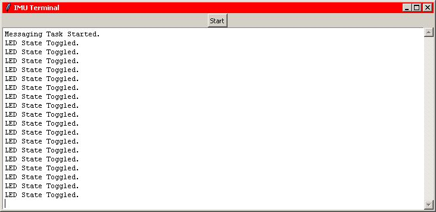

There you have it!  We now have the ability to send wireless messages
from the IMU to a base station.  But more to the point, we have a
working RTOS with two tasks defined and operational.  One task toggles
the LED and posts a message each time it does so and we have a second
task that sends the message to the USART port each time a message is
posted.  Now all we have left to do is to create our IMU task and add it
to the list of tasks for the RTOS.

IMU Task
--------

Next, we will be looking at the heart of this project and that is the
measurement of the forces being applied to the airframe through the use
of an accelerometer and gyroscope.  Above, we've already defined the
APIs that we will be using (and indirectly the I2C driver as well) to
get the three axis values for the accelerometer and gyro.  We also have
a set of APIs that lets us talk to the magnetometer, which will give us
the ability to determine magnetic north should we decide that we need to
know that as well. What we want to do now is to define the IMU Task and
integrate it into the RTOS.

Here is a quick outline for this function

-   Get the three axis readings from the Accelerometer and Gyro
-   Create a string with the information that we just read
-   Send the string to AppPrintMessage()
-   Delay for a while 
-   Go back and do it all over again

That doesn't seen so hard.  So then let's start by declaring the
structures and prototypes that we will be using.  This should look
familiar to you given that we've already updated this section of app.c,
so I'm only including the additions:
```
/*
 ************************************************************************
 *                           LOCAL GLOBAL VARIABLES
 ************************************************************************
 */
 
 ...
 static OS_TCB   AppTaskIMUTCB;
 static CPU_STK  AppTaskIMUStk[APP_CFG_TASK_START_STK_SIZE];
 ...
 
 /*
 ************************************************************************
 *                           FUNCTION PROTOTYPES
 ************************************************************************
 */
 
 ...
 static  void  AppTaskIMU            (void     *p_arg);
 ...
```
And these additions to main() in app.c.  You can place it after the
OSTaskCreate() for the Messaging task:
```
int main(void)
 {
     ...
 
     /* Create the IMU task                            */
     OSTaskCreate((OS_TCB       *)&AppTaskIMUTCB,              
                  (CPU_CHAR     *)"App Task MPU9150",
                  (OS_TASK_PTR   )AppTaskIMU,
                  (void         *)0u,
                  (OS_PRIO       )APP_CFG_TASK_MPU9150_PRIO,
                  (CPU_STK      *)&AppTaskIMUStk[0u],
                  (CPU_STK_SAppTaskStartIZE)AppTaskIMUStk[APP_CFG_TASK_START_STK_SIZE / 10u],
                  (CPU_STK_SIZE  )APP_CFG_TASK_START_STK_SIZE,
                  (OS_MSG_QTY    )0u,
                  (OS_TICK       )0u,
                  (void         *)0u,
                  (OS_OPT        )(OS_OPT_TASK_STK_CHK | OS_OPT_TASK_STK_CLR),
                  (OS_ERR       *)&err);
     ...
 }
```
And than there is the actual code for the IMU task:
```
/*
 ************************************************************************
 *                           IMU TASK
 *
 * Description : The intent of this task is to read the values from the

 *               IMU and send them to the Messaging meadium for display
 *               to the user.
 *
 * Arguments   : p_arg   is the argument passed to 'AppTaskStart()'
 *                       by 'OSTaskCreate()'.
 *
 * Returns     : none
 *
 * Notes       : 1) The first line of code is used to prevent a compiler
 *                  warning because 'p_arg' is not used.  The compiler
 *                  should not generate any code for this statement.
 ************************************************************************
 */
 
 static  void  AppTaskIMU (void *p_arg)
 {
     OS_ERR      err;
     CPU_INT08U  my_char;
     CPU_INT08U  message[MaxMessageLength];
     CPU_INT32S  ax, ay, az, gx, gy, gz, temperature;
     CPU_INT32U  count = 0;
 
     /* Create Application tasks                             */
     (void)p_arg;                                            
 
     AppPrintMessage("IMU Task Started.n");
 
     IMU_Init();
     IMU_Init(); /* something is not initialized in the proper order */
     AppPrintMessage("IMU Initialized.n");
 
     my_char = IMU_GetDeviceID();
     sprintf((char*)message,"IMU Identification Number: 0x%04xn",
              my_char);
     AppPrintMessage(message);
 
     my_char = IMU_GetMagDeviceID();
     sprintf((char*)message, "Magnetometer Identification Number: 0x%04xn",
              my_char);
     AppPrintMessage(message);
 
     CPU_INT32S sx, sy, sz;
     IMU_GetMagSensAdj(&sx, &sy, &sz);
     sprintf((char*)message, "sx = %d, sy = %d, sz = %dn", sx, sy, sz);
     AppPrintMessage(message);
 
     /* Task body, always written as an infinite loop.       */
     while (DEF_TRUE)
     {
         IMU_ReadATG(&ax, &ay, &az, &temperature, &gx, &gy, &gz);
 
         sprintf((char*)message, 
                 "%06d: "
                 "ax = %6d, ay = %6d, az = %6d, "
                 "gx = %6d, gy = %6d, gz = %6dn",
                 count++, ax, ay, az, gx, gy, gz);
         AppPrintMessage(message);
 
         OSTimeDlyHMSM(0u, 0u, 0u, 33u,    /* display reading at 30.3Hz */
                       OS_OPT_TIME_HMSM_STRICT,
                       &err);
     }
 }
```
And again, we will need to set the priority of AppTaskIMU() in
app_cfg.h as follows:
```
/*
 ************************************************************************
 *                           TASK PRIORITIES
 ************************************************************************
 */
 
 #define  APP_CFG_TASK_MPU9150_PRIO                         2u
 #define  APP_CFG_TASK_START_PRIO                           4u
 #define  APP_CFG_TASK_MESSAGE_PRIO                         6u
```
The next change is a simple one.  We will need to remove the print
statement that we added to AppTaskStart() just so that it doesn't cause
any unwanted output to the terminal window.  Once this last coding
change is completed, press the F7 function key and make sure everything
compiles and links without any errors or warnings.  Then we should be
able to repeat the process that we used to test the messaging system. 

To test the IMU code, we will need to hook up the Nucleo to one USB
port while connecting the second xBee module to a second USB port.  You
can then bring up the terminal window in preparation to receive the
expected output.  Then download the program to the Nucleo.  When the
debugger stops at main(), give the go command to execute the program. 
If all went well, your output should look like this screen shot:

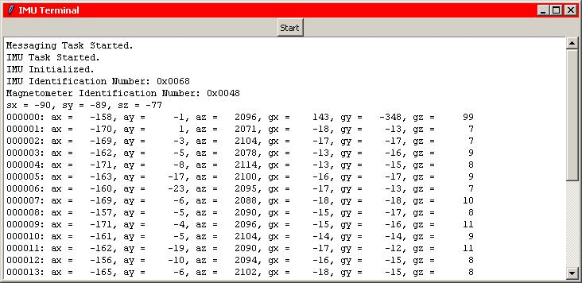

And there you have it, a working wireless IMU. But again and more to the
point, we now have a RTOS running three tasks (threads) in parallel. 
The IMU task is reading the sensor data, packaging the data, and sending
it to the messaging system to be transmitted.  The Messaging task is
receiving messages and sending them to the xBee module.  And the LED
task is still toggling the LED as a visual indication that the RTOS is
running.  And all of this scheduling is being handled by the RTOS with
no input from us other than defining the tesks and the priority of the
tasks.

For fun, you can pick up the Nucleo module and move it around and note
how the data changes in the terminal window.  When you turn the Nucleo
upside-down, the ax data changes from positive to negative and the gyro
data will increase and then decrease with the motion of the device.

Command Task
------------

The last feature of our IMU module that I want to add is the ability to
send commands from the base station to the IMU and I want to do this
wirelessly.  In part, I want to do this to prove that we have
bi-direction communications between the two xBee modules.  But in
reality, I want to do this for it's just plane fun (okay, a bad pun).

So what am I looking for in this Command Task?  What I want is the
ability to send commands from the base station to the IMU to either
change the state of the IMU, or possibly, retrieve additional
information from the IMU.  That seems quite straight forward.  So what
we'll need is a process that will monitor the USART receiver and when a
byte of data comes in, to package the byte in some form of structure. 
Once the process receives an indication that all characters have been
received, it will then send that string off to another routine for
processing.  With this approach, we will then need a second process to
receive the command string, parse the string to determine what command
was sent, and then properly handle that command.  So to start with,
we'll need to define two processes; one process to receive and package
the incoming command string, and a second process to wait to receive a
string and then process the string.

The simplest way to handle the first process, to monitor the USART, is
with an Interrupt ReQuest (YIPPEE!  We get to define an IRQ!) and the
'401RE makes this very simple to do.  What we want is a routine that
will just sit and wait until an event occurs.  In the case of the USART,
this would be when the receive buffer is not empty.  That is, we can set
up the USART to generate an IRQ when ever it receives a character.  We
can set up the IRQ to interrupt the running process and go to our
routine and process that character.  When we're done, the IRQ will
return control back to the prior process just where it left off.  So how
do we do this?

What we will need to do is set up the USART IRQ so that it will go to
our routine when a character comes in to the receiver.  In our routine,
we will need a structure to save the command string until we've received
the last character.  At that time, we will send the command off for
processing.  This sounds a lot like what we we're doing with our
messaging and in reality, it is just like it.  So we will need a command
queue through which we will be sending the command string.  We will also
need to allocate memory in which we will be saving and sending the
command.  The only difference is that this time we will not be using a
counting semaphore.  The reason being that we don't want to take a
change that our IRQ will Pend (wait) for memory.  So at this time, we'll
just allocate enough memory buffers so that we won't run out.  And given
that we're dealing with user generated commands, this is probably a good
approach (famous last words). 

For the second routine, we will need it wait until a command comes in
and then process the command.  Given that we've chosen to use a command
queue, this means that it will Pend (wait) for a command to be posted. 
Once the routine has completed processing the command, it will return
the memory that as used to hold the command back to the operating system
and then Pend (wait) for the next command to be posted to the command
queue.  

So let's start.  At this time, I've chosen just two commands; Run IMU
and Stop IMU. To do this, we will be utilizing Event Flags which is
another IPC provided by the RTOS.  We will be creating an Event Flag to
indicate to the IMU that it is to Run when the flag is set and it is not
to Run when the flag is not set.

So once again, let's start by defining our structures and prototypes in
module app.c: 
```
/*
 ************************************************************************
 *                           LOCAL DEFINES
 ************************************************************************
 */
 
 ...
 
 #define MaxNumCommands 16
 #define MaxCommandLength 32
 
 #define COMMAND_RUN (OS_FLAGS)0x0001

 /*
 ************************************************************************
 *                           LOCAL GLOBAL VARIABLES
 ************************************************************************
 */
 
 ...
 static OS_TCB   AppTaskCommandTCB;
 static CPU_STK  AppTaskCommandStk[APP_CFG_TASK_START_STK_SIZE];
 
 ...
 
 OS_Q            COMMAND_Q;
 OS_MEM          CommandPartition;
 CPU_INT08U      CommandPartitionStorage[MaxNumCommands][MaxCommandLength];
 
 OS_FLAG_GRP     CommandFlagGrp;
 
 /*
 ************************************************************************
 *                           FUNCTION PROTOTYPES
 ************************************************************************
 */
 
 ...
 static  void  AppTaskCommand        (void     *p_arg);
 
 ...
 
 void USART2_IRQHandler(void);
```
Please note the prototype USART2_IRQHandler().  This is the prototype
for our IRQ function that we will be defining below.  

The additions to main() in app.c are as follows:
```
int main(void)
 {
     ...
 
     OSQCreate((OS_Q *)     &COMMAND_Q,
               (CPU_CHAR *) "Command Q",
               (OS_MSG_QTY)  MaxNumCommands,
               (OS_ERR *)   &err);
 
     OSMemCreate((OS_MEM *)      &CommandPartition,
                 (CPU_CHAR *)     "Command Partition",
                 (void *)        &CommandPartitionStorage,
                 (OS_MEM_QTY)     MaxNumCommands,
                 (OS_MEM_SIZE)    MaxCommandLength,
                 (OS_ERR *)      &err);
 
     OSFlagCreate((OS_FLAG_GRP *)       &CommandFlagGrp,
                  (CPU_CHAR *)           "Command Flag Group",
                  (OS_FLAGS)             COMMAND_RUN,
                  (OS_ERR *)            &err);
 
     ...
 
     /* Create the command task                        */
     OSTaskCreate((OS_TCB       *)&AppTaskCommandTCB,              
                  (CPU_CHAR     *)"App Task Command",
                  (OS_TASK_PTR   )AppTaskCommand,
                  (void         *)0u,
                  (OS_PRIO       )APP_CFG_TASK_COMMAND_PRIO,
                  (CPU_STK      *)&AppTaskCommandStk[0u],
                  (CPU_STK_SIZE  )AppTaskCommandStk[APP_CFG_TASK_START_STK_SIZE / 10u],
                  (CPU_STK_SIZE  )APP_CFG_TASK_START_STK_SIZE,
                  (OS_MSG_QTY    )0u,
                  (OS_TICK       )0u,
                  (void         *)0u,
                  (OS_OPT        )(OS_OPT_TASK_STK_CHK | OS_OPT_TASK_STK_CLR),
                  (OS_ERR       *)&err);
     ...
 
 }
```
Then the addition of the Command Processing Task:
```
/*
 ************************************************************************
 *                           Command TASK
 *
 * Description : The intent of this task is to decode the commands coming
 *               from the operator and then set the appropriate event 
 *               flags based on the command.
 *
 * Arguments   : p_arg   is the argument passed to 'AppTaskStart()' by
 *                       'OSTaskCreate()'.
 *
 * Returns     : none
 *
 * Notes       : 1) The first line of code is used to prevent a compiler
 *                  warning because 'p_arg' is not used.  The compiler
 *                  should not generate any code for this statement.
 ************************************************************************
 */
 
 static  void  AppTaskCommand (void *p_arg)
 {
     OS_ERR      err;
     CPU_TS      ts;
     CPU_INT08U* p_cmd;
     OS_MSG_SIZE cmd_size;
 
     (void)p_arg;
 
     AppPrintMessage("Command Task Started.n");
 
     /* Initialize the USART IRQ */
     BSP_IntVectSet(38, USART2_IRQHandler);
     BSP_IntEn(38);
 
     /* Task body, always written as an infinite loop.       */
     while (DEF_TRUE)
     {
         p_cmd = (CPU_INT08U *) OSQPend((OS_Q        *) &COMMAND_Q,
                                        (OS_TICK)        0,
                                        (OS_OPT)         OS_OPT_PEND_BLOCKING,
                                        (OS_MSG_SIZE *) &cmd_size,
                                        (CPU_TS *)      &ts,
                                        (OS_ERR *)      &err);
         //AppPrintMessage(p_cmd);
         switch (p_cmd[0])
         {
         case 'r':
         case 'R':  OSFlagPost((OS_FLAG_GRP *)   &CommandFlagGrp,
                               (OS_FLAGS)         COMMAND_RUN,
                               (OS_FLAGS)         OS_OPT_POST_FLAG_SET,
                               (OS_ERR *)        &err);
                    AppPrintMessage("The IMU is Running!n");
                    break;
         case 's':
         case 'S':  OSFlagPost((OS_FLAG_GRP *)   &CommandFlagGrp,
                               (OS_FLAGS)         COMMAND_RUN,
                               (OS_FLAGS)         OS_OPT_POST_FLAG_CLR,
                               (OS_ERR *)        &err);
                    AppPrintMessage("The IMU is Stopped!n");
                    break;
         }
         OSMemPut((OS_MEM *) &CommandPartition,
                  (void *)    p_cmd,
                  (OS_ERR *) &err);
     }
 }
```
Let's not forget to set AppTaskCommand()'s priority in app_cfg.h:
```
/*
 ************************************************************************
 *                           TASK PRIORITIES
 ************************************************************************
 */
 
 #define  APP_CFG_TASK_MPU9150_PRIO                         2u
 #define  APP_CFG_TASK_START_PRIO                           4u
 #define  APP_CFG_TASK_COMMAND_PRIO                         5u
 #define  APP_CFG_TASK_MESSAGE_PRIO                         6u
```
And last but not least, here's our IRQ to be added to app.c:
```
void USART2_IRQHandler(void)
 {
     OS_ERR              err;
     static CPU_INT08U   str_cnt = 0;
     static CPU_INT08U  *cmd_string;
     const  CPU_INT32U   max_length = MaxCommandLength-1;
     CPU_INT08U          my_char;
 
     if (USART_GetITStatus(USART2, USART_IT_RXNE))
     {
         my_char = USART2->DR;
         if (str_cnt == 0)
         {   /* get memory from the command partition in which */
             /* to save the command                            */
             cmd_string = (CPU_INT08U *) OSMemGet((OS_MEM *) &CommandPartition,
                          (OS_ERR *) &err);
             if (err != OS_ERR_NONE)
                 /* we weren't able to get memory to save command */
                 return;
         }
         /* point to next char in command string */
         cmd_string[str_cnt++] = my_char;
         /* if new line or maximum string length */
         if ((my_char == 'r') || (str_cnt == max_length))
         {   /* send the command */
             /* make sure string is null terminated */
             cmd_string[str_cnt] = '0';
             /* reset for next command */
             str_cnt = 0;
             /* post command in command queue */
             OSQPost((OS_Q *)      &COMMAND_Q,
                     (void *)       cmd_string,
                     (OS_MSG_SIZE)  sizeof(void *),
                     (OS_OPT)       OS_OPT_POST_FIFO,
                     (OS_ERR*)     &err);
 
         }
     }
 }
```
Opps... I almost forgot something.  We need to modify AppTaskIMU() with
a little bit of code to monitor the Run flag so that it will actualy
Pend (wait) when the flag isn't set as shown below:
```
    /* Task body, always written as an infinite loop.       */
     while (DEF_TRUE)
     {
         CPU_TS      ts;
         OSFlagPend((OS_FLAG_GRP *)      &CommandFlagGrp,
                    (OS_FLAGS)            COMMAND_RUN,
                    (OS_TICK)             0,
                    (OS_OPT)              OS_OPT_PEND_FLAG_SET_ALL,
                    (CPU_TS *)           &ts,
                    (OS_ERR *)           &err);
 
         IMU_ReadATG(&ax, &ay, &az, &temperature, &gx, &gy, &gz);
 
         sprintf((char*)message, 
                 "%06d: "
                 "ax = %6d, ay = %6d, az = %6d, "
                 "gx = %6d, gy = %6d, gz = %6dn",
                 count++, ax, ay, az, gx, gy, gz);
         AppPrintMessage(message);
 
         OSTimeDlyHMSM(0u, 0u, 0u, 33u,    /* display reading at 30.3Hz */
                       OS_OPT_TIME_HMSM_STRICT,
                       &err);
     }
```
Once you have the changes completed, you can once again press F7 to make
sure everything compiles without errors or warnings.  Once you're happy
with everything, downloadthe program to the Nucleo board and give it a
Go. 

The final step will be to verify that we can start and stop the IMU from
a serial terminal by sending either r or R to start the IMU and either s
or S to stop the IMU.  We can use my Python IMU Terminal for testing
this feature as well.  As I've demonstrated in the screenshot below,
it's just a simple matter of pressing the button to stop the IMU:

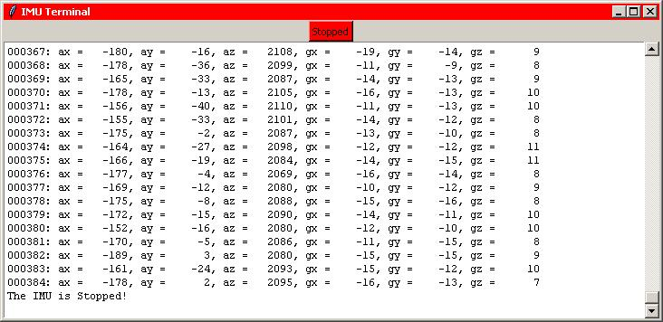

And then a simple matter of pressing the button to start the IMU:

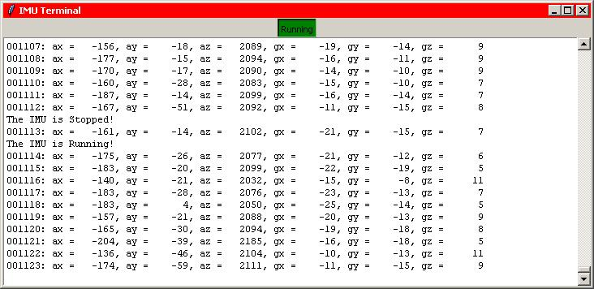

Again, this proves that we now have a RTOS running four independent
tasks; IMU, Messaging, Command, and LED.  And this required no changes
to the RTOS other than to define our task and give it a priority.


That's it for now.  I hope that you enjoyed my little project as much
as I've enjoyed developing it and presenting it to you for your
consideration.

Take care...
